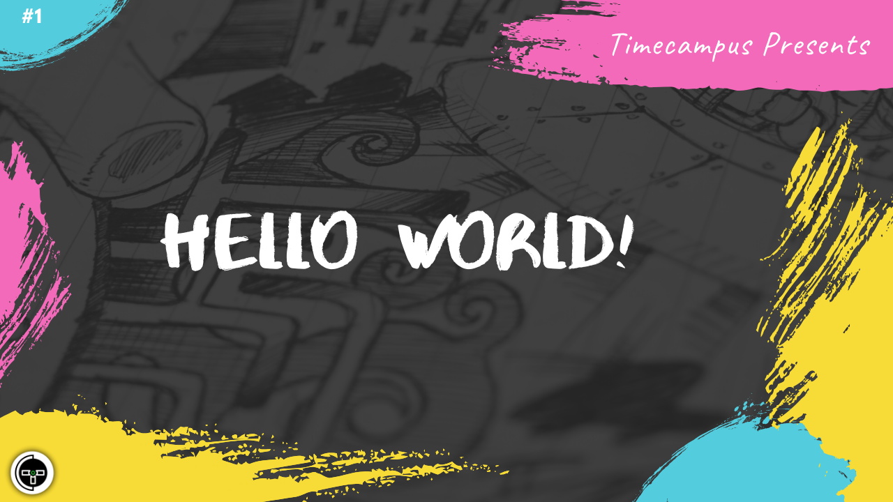

# Episode 1 - Hello World

This is the 1st episode from our series Never Stop. This gives an overview about this series and its format along with a brief introduction about the topics which we would be starting with, the schedule and how you can reach out to us to make these sessions more interactive, engaging and productive.

## Schedule

[June 15th 2020, 9:00 PM - 9:45 PM Indian Standard Time (IST)](https://calendar.google.com/event?action=TEMPLATE&tmeid=M2xpOXFjZjNoa2Y0bzJqcmhmYWtwaDMwN2sgdGltZWNhbXB1cy5jb21fM2hxNHB0a3MwbGUycm5kMGowMW82MDE0YWdAZw&tmsrc=timecampus.com_3hq4ptks0le2rnd0j01o6014ag%40group.calendar.google.com)

30 minutes for the session, 15 minutes for Q&A and random chat

## Agenda

The agenda of this session are as follows

- [ ] About Timecampus
- [ ] Introduction to this series
- [ ] A brief overview about the topics we will cover with details on the schedule
- [ ] Ways to mutually engage and collaborate with each other
- [ ] Pre-requisites, Expectations & Engagement

## Speaker(s)

- [Vignesh T.V.](http://tvvignesh.com/)