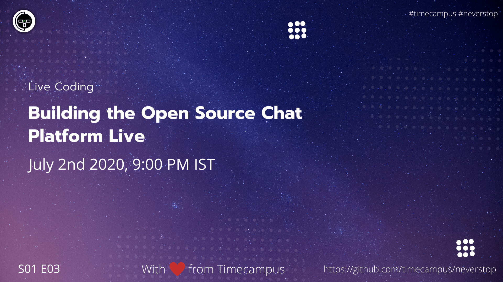

# Product Development S01E02 - The StackProduct Development - The Stack - Timecampus #NeverStop

In this episode, we will look at how to go about choosing the right tech stack depending on our usecase and architecture. We will dive deep on what to keep into account when deciding the right tool or software for you with practical examples.

## Stream Links

Youtube: https://www.youtube.com/watch?v=fN5uvm-7E1I

Facebook: https://www.facebook.com/timecampustech/live/

Twitch: https://www.twitch.tv/timecampus

Mixer: https://mixer.com/timecampus

Periscope: https://periscope.tv/timecampus

Smashcast: https://www.smashcast.tv/timecampus

## Schedule

[July 1st 2020, 9:00 PM - 9:30 PM Indian Standard Time (IST)](https://calendar.google.com/event?action=TEMPLATE&tmeid=MHRkdGY1ZmRha3VybXNoaG10ZDJkY28xbGNfMjAyMDA3MDJUMTUzMDAwWiB0aW1lY2FtcHVzLmNvbV8zaHE0cHRrczBsZTJybmQwajAxbzYwMTRhZ0Bn&tmsrc=timecampus.com_3hq4ptks0le2rnd0j01o6014ag%40group.calendar.google.com)

20 minutes for the session, 10 minutes for Q&A and random chat

## Agenda

The agenda of this session are as follows

- [ ] The Client
- [ ] The Server
- [ ] The Plugins

## Resources

[View Slides](https://docs.google.com/presentation/d/18e3zhBKY1HPQC3vFjzuRkO3AMp89HbTGuXtdl-mjnTo/edit?usp=sharing)

## Speaker(s)

- [Vignesh T.V.](http://tvvignesh.com/)