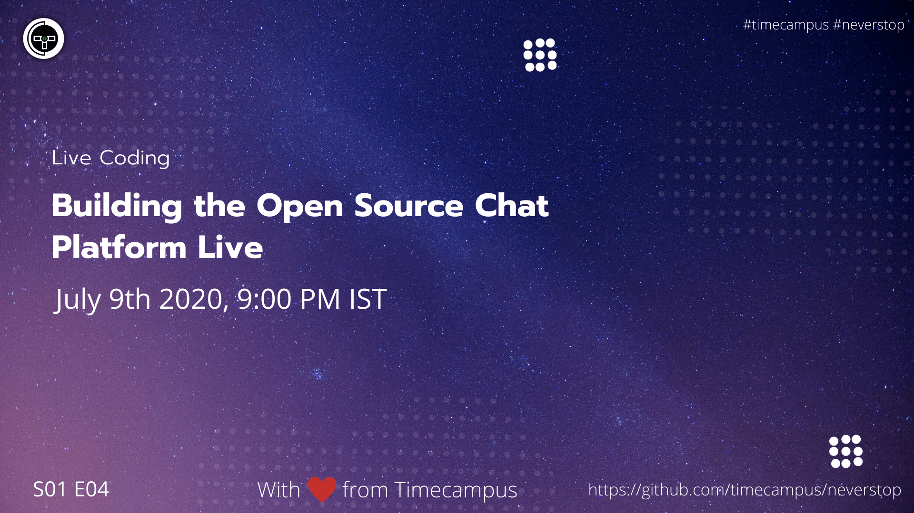

# Live Coding S01E04

Let's continue coding out multi-streaming chat app live!

## Stream Links

Youtube: https://www.youtube.com/watch?v=nE4tKrXsdBo

Facebook: https://www.facebook.com/timecampustech/live/

Twitch: https://www.twitch.tv/timecampus

Mixer: https://mixer.com/timecampus

Periscope: https://periscope.tv/timecampus

Smashcast: https://www.smashcast.tv/timecampus

## Schedule

[July 9th 2020, 9:00 PM - 9:30 PM Indian Standard Time (IST)](https://calendar.google.com/event?action=TEMPLATE&tmeid=MHRkdGY1ZmRha3VybXNoaG10ZDJkY28xbGNfMjAyMDA3MDlUMTUzMDAwWiB0aW1lY2FtcHVzLmNvbV8zaHE0cHRrczBsZTJybmQwajAxbzYwMTRhZ0Bn&tmsrc=timecampus.com_3hq4ptks0le2rnd0j01o6014ag%40group.calendar.google.com)

20 minutes for the session, 10 minutes for Q&A and random chat

## Agenda

The agenda of this session are as follows

- [ ] Working on Websockets and real-time chat

## Resources

[View Slides](https://docs.google.com/presentation/d/1XzzDuoZeXmz68fN8NGW3GAMeaHPeWVYbF0vXu7q3-xQ/edit?usp=sharing)

## Speaker(s)

- [Vignesh T.V.](http://tvvignesh.com/)