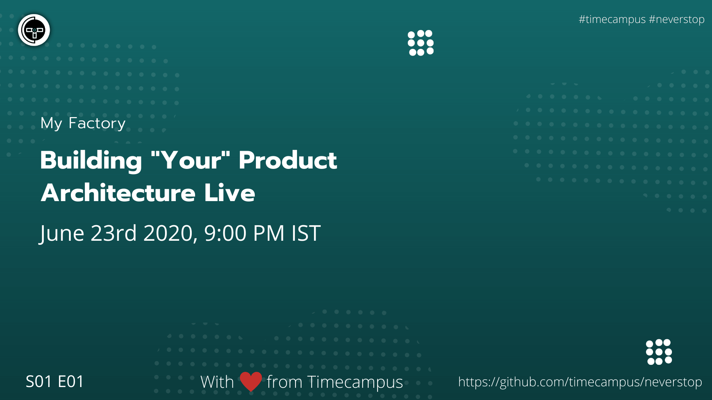

# My Factory S01E01

In this episode, we will see the most important questions which a product manager has to answer even before starting to build out a product. Why, What, How and Who. Will be talking about this in detail and how to go about answering these questions.

## Stream Links

Youtube: https://www.youtube.com/watch?v=OobfTpwrhUg

Facebook: https://www.facebook.com/timecampustech/videos/895377447646626/

Twitch: https://www.twitch.tv/timecampus

Mixer: https://mixer.com/timecampus

Periscope: https://periscope.tv/timecampus

Smashcast: https://www.smashcast.tv/timecampus

## Schedule

[June 23rd 2020, 9:00 PM - 9:30 PM Indian Standard Time (IST)](https://calendar.google.com/event?action=TEMPLATE&tmeid=NjV1cWlwMGEwOGZiM2JqMGRhOWJkM2wzbWQgdGltZWNhbXB1cy5jb21fM2hxNHB0a3MwbGUycm5kMGowMW82MDE0YWdAZw&tmsrc=timecampus.com_3hq4ptks0le2rnd0j01o6014ag%40group.calendar.google.com)

20 minutes for the session, 10 minutes for Q&A and random chat

## Agenda

The agenda of this session are as follows

- [ ] About the Series
- [ ] The Problem Statement
- [ ] The Constraints
- [ ] Research
- [ ] Solution
- [ ] Validation
- [ ] Iterations

## Resources

[View Slides](https://docs.google.com/presentation/d/18Hg_l2KK1ipgpG5rjipe9rMiiGwkOf1qJ8DweOlM65g/edit?usp=sharing)

[Diagram](https://drive.google.com/file/d/1efwN6lPT_KA0NaFgKOnK344hnatzSZKr/view?usp=sharing)

## Speaker(s)

- [Vignesh T.V.](http://tvvignesh.com/)