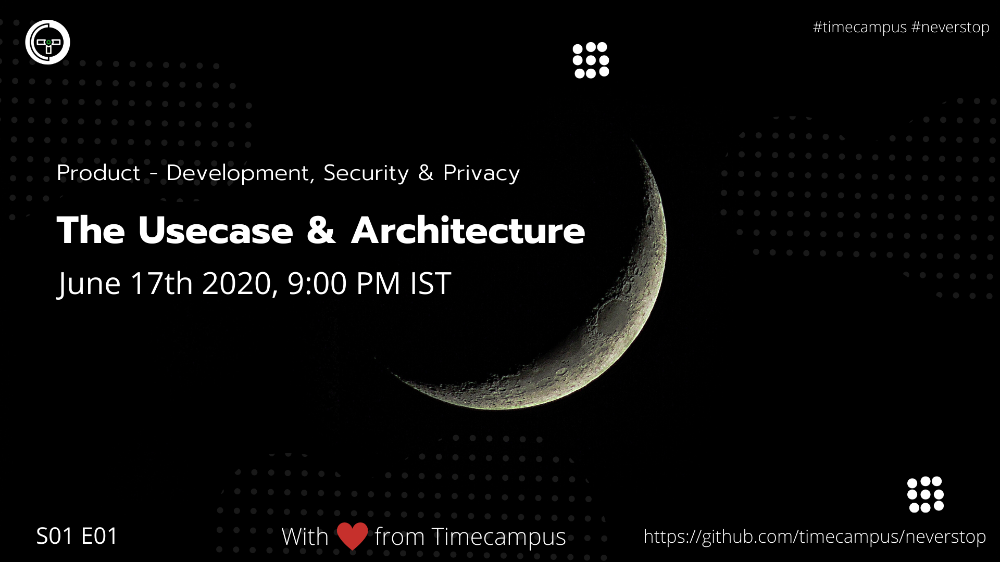

# Product Development S01E01 - The Usecase & Architecture

In this episode, we will look at how to go about architecting a product given a usecase.

## Stream Links

Youtube: https://www.youtube.com/watch?v=hJO7U0DuC2o

Facebook: https://www.facebook.com/timecampustech/videos/268966667525673/

Twitch: https://www.twitch.tv/timecampus

Mixer: https://mixer.com/timecampus

Periscope: https://periscope.tv/timecampus

Smashcast: https://www.smashcast.tv/timecampus

## Schedule

[June 17th 2020, 9:00 PM - 9:30 PM Indian Standard Time (IST)](https://calendar.google.com/event?action=TEMPLATE&tmeid=NmtlbjZzNHE1dGVkZ3V0NWduNjRhazU5b2QgdGltZWNhbXB1cy5jb21fM2hxNHB0a3MwbGUycm5kMGowMW82MDE0YWdAZw&tmsrc=timecampus.com_3hq4ptks0le2rnd0j01o6014ag%40group.calendar.google.com)

20 minutes for the session, 10 minutes for Q&A and random chat

## Agenda

The agenda of this session are as follows

- [ ] About the Series
- [ ] The Use Case
- [ ] The Problem
- [ ] Expectations
- [ ] The Architecture
- [ ] The Stack
- [ ] Ask Me Anything

## Resources

[View Slides](https://docs.google.com/presentation/d/1EzOSkvM-B5PmNA2S0myPMc5Xi6JyyOHqCHOo2fXfFAw/edit?usp=sharing)

## Speaker(s)

- [Vignesh T.V.](http://tvvignesh.com/)