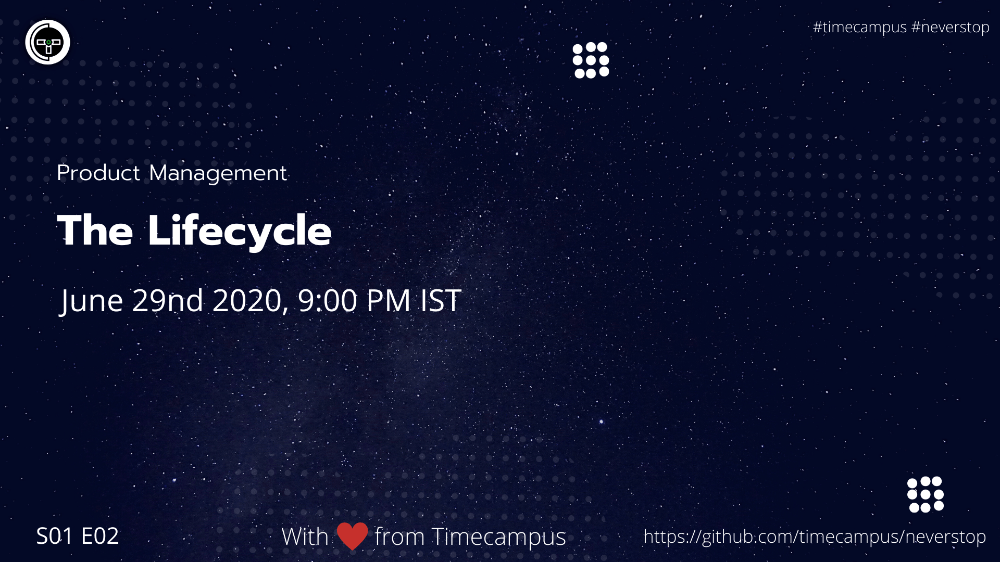

# Product Management S01E02 - The Lifecycle

In this episode, we will see the most important questions which a product manager has to answer even before starting to build out a product. Why, What, How and Who. Will be talking about this in detail and how to go about answering these questions.

## Stream Links

Youtube: https://www.youtube.com/watch?v=WVl32gJ33xI

Facebook: https://www.facebook.com/timecampustech/videos/1165531507179405/

Twitch: https://www.twitch.tv/timecampus

Mixer: https://mixer.com/timecampus

Periscope: https://periscope.tv/timecampus

Smashcast: https://www.smashcast.tv/timecampus

## Schedule

[June 22nd 2020, 9:00 PM - 9:30 PM Indian Standard Time (IST)](https://calendar.google.com/event?action=TEMPLATE&tmeid=MmhtNGhoZWE3dGVtYXJpM3U5cDhsbWFjdm4gdGltZWNhbXB1cy5jb21fM2hxNHB0a3MwbGUycm5kMGowMW82MDE0YWdAZw&tmsrc=timecampus.com_3hq4ptks0le2rnd0j01o6014ag%40group.calendar.google.com)

20 minutes for the session, 10 minutes for Q&A and random chat

## Agenda

The agenda of this session are as follows

- [ ] The Product Life Cycle
- [ ] Introduction
- [ ] Growth
- [ ] Maturity
- [ ] Decline

## Resources

[View Slides](https://docs.google.com/presentation/d/1ayIzTUt8BxldI7l8xsf0VOwLzw9PJuF9-khesY_H0uw/edit?usp=sharing)

## Speaker(s)

- [Vignesh T.V.](http://tvvignesh.com/)