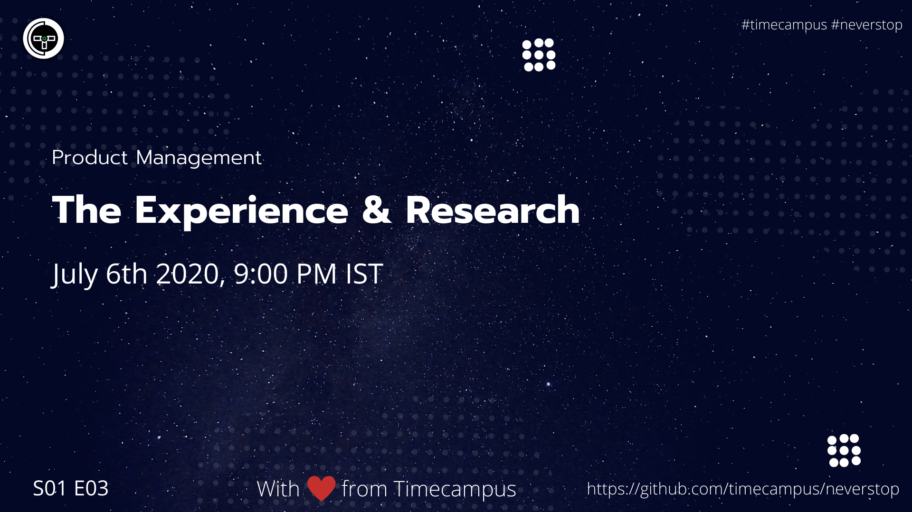

# Product Management S01E02 - The Lifecycle

In this episode, we will see how the product lifecycle goes and how you, as a product manager, entrepreneur or a business leader go about deciding what action to take, how to take it and when to take it depending on the stage your product is in.

## Stream Links

Youtube: https://www.youtube.com/watch?v=4-1FNsM10mE

Facebook: https://www.facebook.com/timecampustech/live/

Twitch: https://www.twitch.tv/timecampus

Mixer: https://mixer.com/timecampus

Periscope: https://periscope.tv/timecampus

Smashcast: https://www.smashcast.tv/timecampus

## Schedule

[July 6th 2020, 9:00 PM - 9:30 PM Indian Standard Time (IST)](https://calendar.google.com/event?action=TEMPLATE&tmeid=MG5hYzFlamhkMjRhNW9xY2d0c2cwcm43NTZfMjAyMDA3MDZUMTUzMDAwWiB0aW1lY2FtcHVzLmNvbV8zaHE0cHRrczBsZTJybmQwajAxbzYwMTRhZ0Bn&tmsrc=timecampus.com_3hq4ptks0le2rnd0j01o6014ag%40group.calendar.google.com)

20 minutes for the session, 10 minutes for Q&A and random chat

## Agenda

The agenda of this session are as follows

- [ ] The Product Life Cycle
- [ ] Introduction
- [ ] Growth
- [ ] Maturity
- [ ] Decline

## Resources

[View Slides](https://docs.google.com/presentation/d/11sLcrDMZB6L_mHU-nY1k8HiOwfqVpyFeXD_k5sNIZAQ/edit?usp=sharing)

## References

- https://win-loss.agency/post/product-management-market-research/
- https://prodmonk.com/product-management-101/how-to-conduct-user-research/
- https://www.aha.io/roadmapping/guide/product-strategy/how-should-product-managers-research-competitors
- https://www.prodpad.com/blog/steps-to-becoming-a-product-manager/
- https://www.productplan.com/product-manager-communities/

## Speaker(s)

- [Vignesh T.V.](http://tvvignesh.com/)