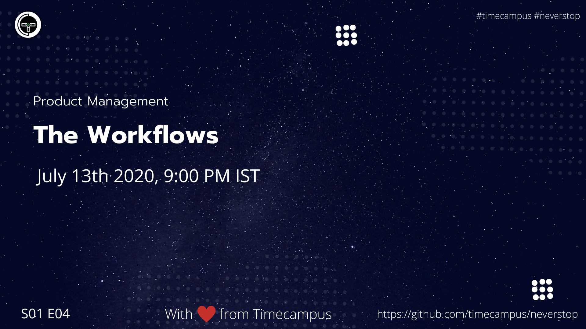

# Product Management S01E04 - The Workflows

In this episode, we will see talk about the various product management workflows like Agile, Scrum, Kanban, Lean and Waterfall and will also talk about which to choose and when.

## Stream Links

Youtube: https://www.youtube.com/watch?v=ZbQZwW05vMI

Facebook: https://www.facebook.com/timecampustech/live/

Twitch: https://www.twitch.tv/timecampus

Mixer: https://mixer.com/timecampus

Periscope: https://periscope.tv/timecampus

Smashcast: https://www.smashcast.tv/timecampus

## Schedule

[July 13th 2020, 9:00 PM - 9:30 PM Indian Standard Time (IST)](https://calendar.google.com/event?action=TEMPLATE&tmeid=MG5hYzFlamhkMjRhNW9xY2d0c2cwcm43NTZfMjAyMDA3MTNUMTUzMDAwWiB0aW1lY2FtcHVzLmNvbV8zaHE0cHRrczBsZTJybmQwajAxbzYwMTRhZ0Bn&tmsrc=timecampus.com_3hq4ptks0le2rnd0j01o6014ag%40group.calendar.google.com)

20 minutes for the session, 10 minutes for Q&A and random chat

## Agenda

The agenda of this session are as follows

- [ ] Agile
- [ ] Scrum
- [ ] Waterfall
- [ ] Kanban
- [ ] Lean
- [ ] What to choose and when?

## Resources

[View Slides](https://docs.google.com/presentation/d/1CLY8lAPk30w3bx1jQhvlH8M2ZilhgrnAQEzA1pPDuCg/edit?usp=sharing)

## References

- https://www.smartsheet.com/agile-vs-scrum-vs-waterfall-vs-kanban
- http://agilemanifesto.org/principles.html
- https://hangoutagile.com/lean-software-development-wave-ii/

## Speaker(s)

- [Vignesh T.V.](http://tvvignesh.com/)