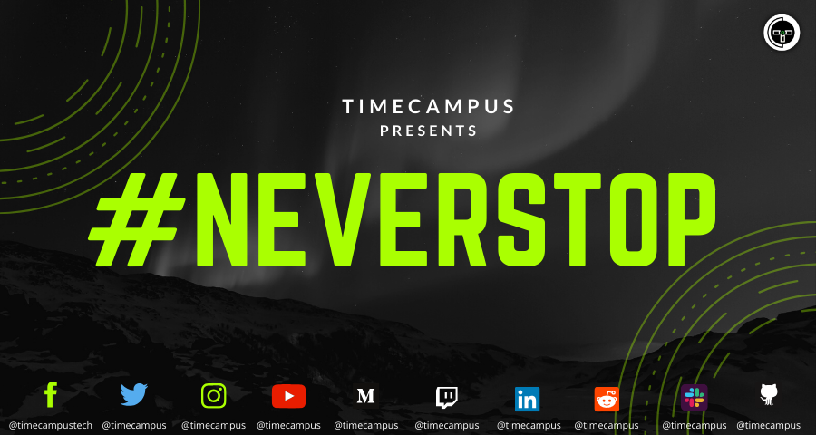

# NeverStop

Accompanying repository to Timecampus's Official Series #NeverStop

---

### About the Series

If you are new here and not sure what this series is all about, you can watch this video: [http://www.youtube.com/watch?v=MPgacYEXIDg](http://www.youtube.com/watch?v=MPgacYEXIDg)

---

### Platforms

We stream on all these platforms

Youtube - https://www.youtube.com/channel/UCLnTH4GOCB5fXWoOfgklQwA

Facebook - https://www.facebook.com/timecampustech/

Twitch - https://www.twitch.tv/timecampus

Mixer - https://mixer.com/timecampus

LinkedIn - https://www.linkedin.com/company/timecampus/events/

Periscope - https://www.periscope.tv/timecampus

Smashcast - https://www.smashcast.tv/timecampus

Mobcrush - https://www.mobcrush.com/timecampus

DLive - https://dlive.tv/timecampus

VK - https://vk.com/timecampus

---

## SERIES LIST (#NeverStop)

- [Product - Management](product-management/overview.md) - Every Monday at 9:00 PM IST

- [My Factory](my-factory/overview.md) - Every Tuesday at 9:00 PM IST

- [Product - Development, Security & Privacy](product-development/overview.md) - Every Wednesday at 9:00 PM IST

- [Live Coding](live-coding/overview.md) - Every Thursday at 9:00 PM IST

- [The Entrepreneur](the-entrepreneur/overview.md) - Every Friday at 9:00 PM IST

- [The Red Capet](the-red-carpet/overview.md) - Every Saturday at 9:00 PM IST

---

## Schedule

NOTE: Updates in progress, while the schedule has been finalized, not all the contents are available yet. We will be gradually adding content to this repository.

[View the Calendar](https://calendar.google.com/calendar/embed?src=timecampus.com_3hq4ptks0le2rnd0j01o6014ag%40group.calendar.google.com&ctz=Asia%2FKolkata)

[Download ICS file](https://calendar.google.com/calendar/ical/timecampus.com_3hq4ptks0le2rnd0j01o6014ag%40group.calendar.google.com/public/basic.ics)

## NOTE:

These are not meant to be tutorials and we don't intend to make one since there are lot of resources already available on the web. Rather, this series is meant to be a guide to introduce, share experiences, best/worst practices and also point you to the right references for you to get started off quickly without any issues.

WE DON'T BELIEVE IN SPOON FEEDING!

---

### Links

[Support us on Patreon](https://www.patreon.com/timecampus)

[Timecampus Alpha Participation](https://docs.google.com/forms/d/1-fHizPhuXqDKqFZ2ns7Ttl00mT13DtjsRbHE5KtpxXs/viewform)

[Timecampus Careers & Internships](https://docs.google.com/forms/d/1jHW-I5yjHl49itwoyM5xxYUao0X1fbnnoxJd78fS5u8/viewform)

[Investors](https://docs.google.com/forms/d/13jkHPdvqoMDNsyzpC8-Dbv0lai8bXOvOLIovey7hfUM/viewform)

[For Consultancy](https://docs.google.com/forms/d/e/1FAIpQLSeCb-Pu7Hcnh7oRvleRka2VW8EVZ6d8cNEccV7jKVmzhE6ilg/viewform)

---

## Timecampus on Social Media

[Facebook](https://facebook.com/timecampustech/) | [Twitter](https://twitter.com/timecampus) | [LinkedIn](https://www.linkedin.com/in/tvvignesh) | [Medium](https://medium.com/timecampus) | [Instagram](https://www.instagram.com/timecampus/) | [Reddit](https://www.reddit.com/r/timecampus) | [Pinterest](https://pinterest.com/timecampus) | [Join us on Slack](https://join.slack.com/t/timecampus/shared_invite/zt-agqkaodc-IZtldnJbIXuxi86b7NgNFQ) | [Join us on Discord](https://discord.gg/A7DU8BX)