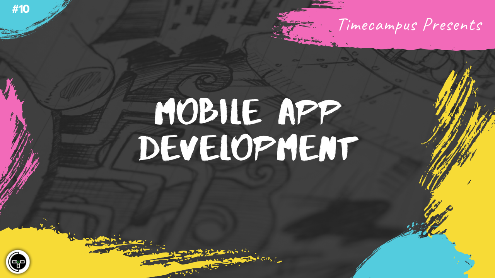

# Episode 10 - Mobile App Development

This is the 10th episode from the series Never Stop. Mobile Apps have been in very wide use in the market with loads of Android and IOS apps being made every day and pushed to the stores. But, it is important to understand the strategy behind build Mobile Apps. Should you go Native, should you go Hybrid, what are your options, the tools and frameworks available, We will also talk about Cordova, Capacitor, Android, IOS, Firebase and a lot more.

## Schedule

[July 6th 2020, 9:00 PM - 9:45 PM Indian Standard Time (IST)](https://calendar.google.com/event?action=TEMPLATE&tmeid=NGdxdHBwbTFtcThtMHFna2k2cmt0NGE0c2MgdGltZWNhbXB1cy5jb21fM2hxNHB0a3MwbGUycm5kMGowMW82MDE0YWdAZw&tmsrc=timecampus.com_3hq4ptks0le2rnd0j01o6014ag%40group.calendar.google.com)

30 minutes for the session, 15 minutes for Q&A and random chat

## Agenda

The agenda of this session are as follows

- [ ] Native/Hybrid Apps/Trusted Web Activity
- [ ] Mobile App Development Lifecycle
- [ ] Tools, Frameworks & Libraries
- [ ] Cordova & Capacitor
- [ ] Firebase

## Resources

[View Slides](#) (Will be available immediately after the session)

[Session Recording](#) (Will be available immediately after the session)

[Article](#) (Will be available immediately after the session)

## Speaker(s)

- [Vignesh T.V.](http://tvvignesh.com/)

------------------------------------------

## Links

[Support us on Patreon](https://www.patreon.com/timecampus)

[Timecampus Alpha Participation](https://docs.google.com/forms/d/1-fHizPhuXqDKqFZ2ns7Ttl00mT13DtjsRbHE5KtpxXs/viewform)

[Timecampus Careers & Internships](https://docs.google.com/forms/d/1jHW-I5yjHl49itwoyM5xxYUao0X1fbnnoxJd78fS5u8/viewform)

[Investors](https://docs.google.com/forms/d/13jkHPdvqoMDNsyzpC8-Dbv0lai8bXOvOLIovey7hfUM/viewform)

[For Consultancy](https://docs.google.com/forms/d/e/1FAIpQLSeCb-Pu7Hcnh7oRvleRka2VW8EVZ6d8cNEccV7jKVmzhE6ilg/viewform)
