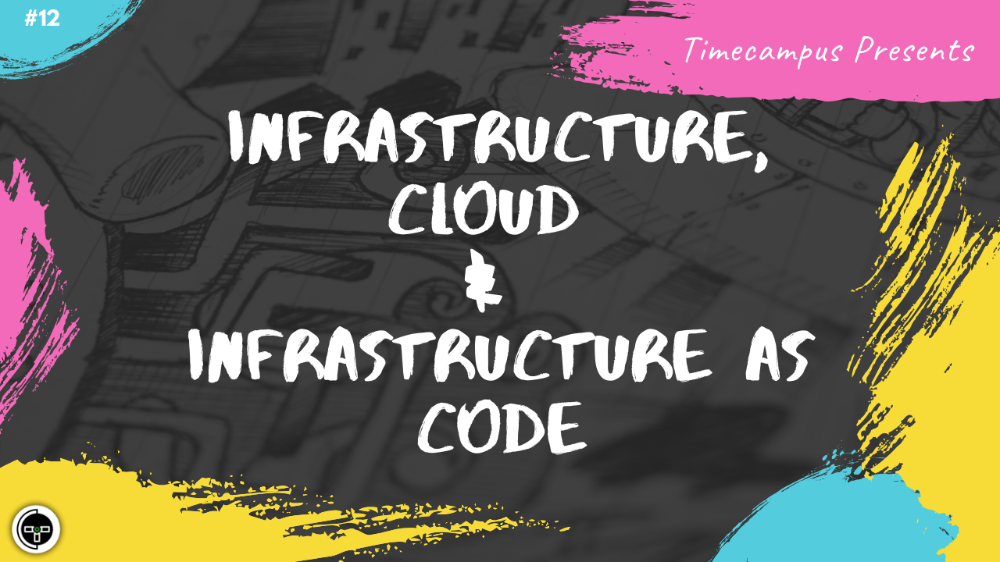

# Episode 12 - Infrastructure, Cloud & Infrastructure as Code

This is the 12th episode from the series Never Stop. In this episode, we will talk about Cloud Computing, choosing your cloud provider according to your use case, selecting the office suite, and managing infrasture using Infrastructure as Code tools like Terraform on GCP.

## Schedule

[July 10th 2020, 9:00 PM - 9:45 PM Indian Standard Time (IST)]()

30 minutes for the session, 15 minutes for Q&A and random chat

## Agenda

The agenda of this session are as follows

- [ ] Cloud Computing
- [ ] Cloud Providers
- [ ] Office Suite
- [ ] GCP
- [ ] Terraform

## Speaker(s)

- [Vignesh T.V.](http://tvvignesh.com/)
