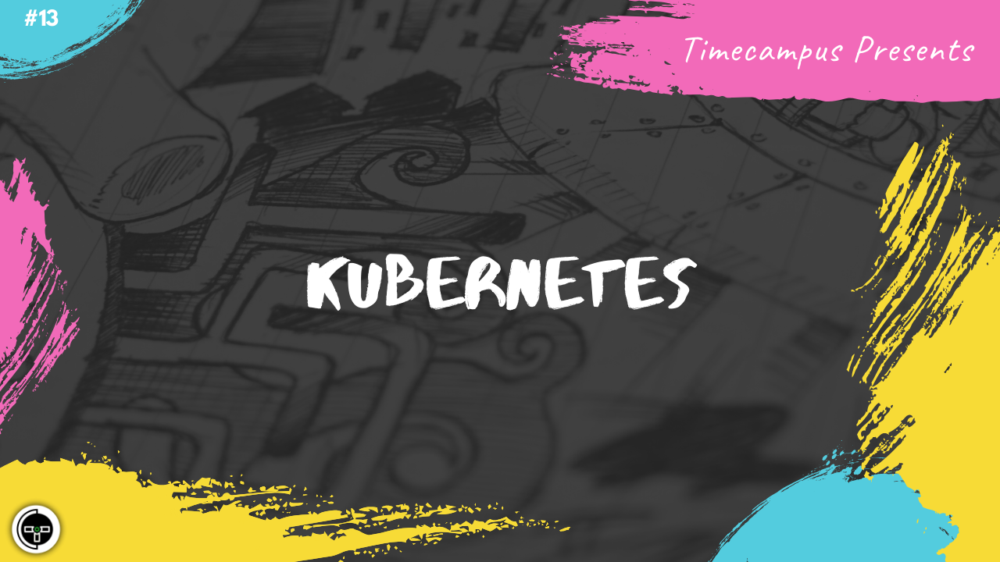

# Episode 13 - Kubernetes

This is the 13th episode from the series Never Stop. In this episode, we will talk about how Kubernetes has completely transformed the infrastructure management landscape with deep discussions on various resources like Namespaces, Pods, Deployment, Services, ConfigMaps, Secrets, Volumes, Ingress, Pod Security Policies, Network Policy and more.

We will have a look at self-hosting kubernetes and also see how services providers like GKE,AKS,EKS, etc. have made it very easy to manage kubernetes on cloud rather than managing it ourselves.

## Schedule

[July 13th 2020, 9:00 PM - 9:45 PM Indian Standard Time (IST)]()

30 minutes for the session, 15 minutes for Q&A and random chat

## Agenda

The agenda of this session are as follows

- [ ] Container Orchestration
- [ ] Kubernetes
- [ ] Kubernetes Resources
- [ ] Self-hosting Kubernetes
- [ ] Managed Kubernetes Offerings

## Speaker(s)

- [Vignesh T.V.](http://tvvignesh.com/)
