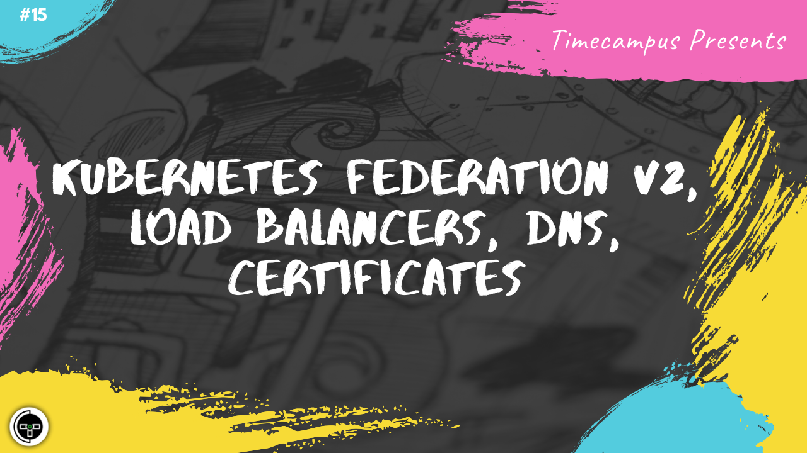

# Episode 15 - Kubernetes Federation V2, Load Balancers, DNS, Certificates

This is the 15th episode from the series Never Stop. In this episode, we will see how we can manage multiple Kubernetes clusters even if they are in different regions or with different cloud providers using Kubefed, we will also have a look at what load balancers exploring things like Global Load Balancer, Regional Load Balancer and more, we will also look at the role of DNS, DNS Records, we will also be looking at SSL Certificates and how to issue them manually/automatically using services and tools like LetsEncrypt & Cert-Manager.

## Schedule

[July 17th 2020, 9:00 PM - 9:45 PM Indian Standard Time (IST)](https://calendar.google.com/event?action=TEMPLATE&tmeid=MDZoaXFhaDgxajVoYm8zZWwxZjFqNXA0OXAgdGltZWNhbXB1cy5jb21fM2hxNHB0a3MwbGUycm5kMGowMW82MDE0YWdAZw&tmsrc=timecampus.com_3hq4ptks0le2rnd0j01o6014ag%40group.calendar.google.com)

30 minutes for the session, 15 minutes for Q&A and random chat

## Agenda

The agenda of this session are as follows

- [ ] Kubernetes Federation V2
- [ ] Load Balancers
- [ ] DNS & DNS Records
- [ ] SSL Certificates
- [ ] LetsEncrypt & Cert-Manager

## Resources

[View Slides](#) (Will be available immediately after the session)

[Session Recording](#) (Will be available immediately after the session)

[Article](#) (Will be available immediately after the session)

## Speaker(s)

- [Vignesh T.V.](http://tvvignesh.com/)

------------------------------------------

## Links

[Support us on Patreon](https://www.patreon.com/timecampus)

[Timecampus Alpha Participation](https://docs.google.com/forms/d/1-fHizPhuXqDKqFZ2ns7Ttl00mT13DtjsRbHE5KtpxXs/viewform)

[Timecampus Careers & Internships](https://docs.google.com/forms/d/1jHW-I5yjHl49itwoyM5xxYUao0X1fbnnoxJd78fS5u8/viewform)

[Investors](https://docs.google.com/forms/d/13jkHPdvqoMDNsyzpC8-Dbv0lai8bXOvOLIovey7hfUM/viewform)

[For Consultancy](https://docs.google.com/forms/d/e/1FAIpQLSeCb-Pu7Hcnh7oRvleRka2VW8EVZ6d8cNEccV7jKVmzhE6ilg/viewform)
