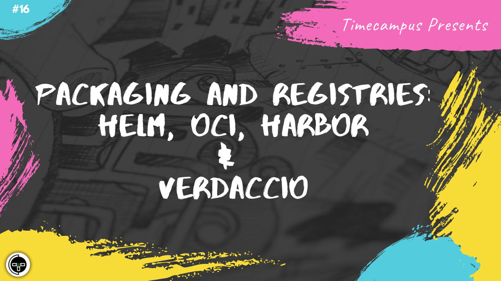

# Episode 16 - Packaging And Registries - Helm, OCI, Harbor, Verdaccio

This is the 16th episode from the series Never Stop. In this episode, we will see how we can package, test and deploy our infrastucture deliverables using Helm v3, OCI (Open Container Initiative), Harbor v2 and use tools like Verdaccio for managing a private NPM registry.

## Schedule

[July 20th 2020, 9:00 PM - 9:45 PM Indian Standard Time (IST)]()

30 minutes for the session, 15 minutes for Q&A and random chat

## Agenda

The agenda of this session are as follows

- [ ] Helm
- [ ] OCI
- [ ] Harbor
- [ ] Verdaccio

## Speaker(s)

- [Vignesh T.V.](http://tvvignesh.com/)
