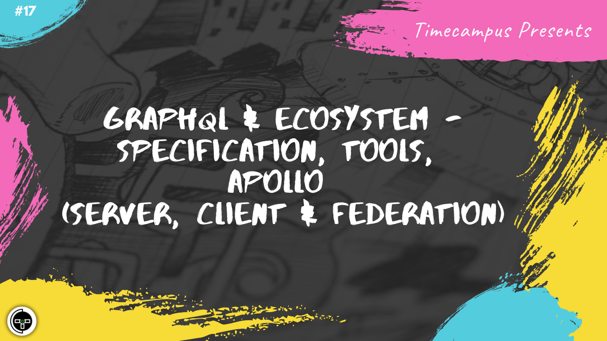

# Episode 17 - GraphQL & Ecosystem - Specification, Tools, Apollo (Server, Client & Federation)

This is the 17th episode from the series Never Stop. In this episode, we will see how amazing GraphQL is. We will discuss about the specification, look at some tools and dive deep into Apollo's ecosystem - Apollo Server, Apollo Client & Apollo Federation to understand how we can stitch everything together.

## Schedule

[July 22nd 2020, 9:00 PM - 9:45 PM Indian Standard Time (IST)](https://calendar.google.com/event?action=TEMPLATE&tmeid=MTBxYmlkMjBlcG9paXU2M2s4aWUyOHZsMHQgdGltZWNhbXB1cy5jb21fM2hxNHB0a3MwbGUycm5kMGowMW82MDE0YWdAZw&tmsrc=timecampus.com_3hq4ptks0le2rnd0j01o6014ag%40group.calendar.google.com)

30 minutes for the session, 15 minutes for Q&A and random chat

## Agenda

The agenda of this session are as follows

- [ ] GraphQL Specification
- [ ] GraphQL Ecosystem & Tools
- [ ] Apollo Server
- [ ] Apollo Federation
- [ ] Apollo Client

## Resources

[View Slides](#) (Will be available immediately after the session)

[Session Recording](#) (Will be available immediately after the session)

[Article](#) (Will be available immediately after the session)

## Speaker(s)

- [Vignesh T.V.](http://tvvignesh.com/)

------------------------------------------

## Links

[Support us on Patreon](https://www.patreon.com/timecampus)

[Timecampus Alpha Participation](https://docs.google.com/forms/d/1-fHizPhuXqDKqFZ2ns7Ttl00mT13DtjsRbHE5KtpxXs/viewform)

[Timecampus Careers & Internships](https://docs.google.com/forms/d/1jHW-I5yjHl49itwoyM5xxYUao0X1fbnnoxJd78fS5u8/viewform)

[Investors](https://docs.google.com/forms/d/13jkHPdvqoMDNsyzpC8-Dbv0lai8bXOvOLIovey7hfUM/viewform)

[For Consultancy](https://docs.google.com/forms/d/e/1FAIpQLSeCb-Pu7Hcnh7oRvleRka2VW8EVZ6d8cNEccV7jKVmzhE6ilg/viewform)
