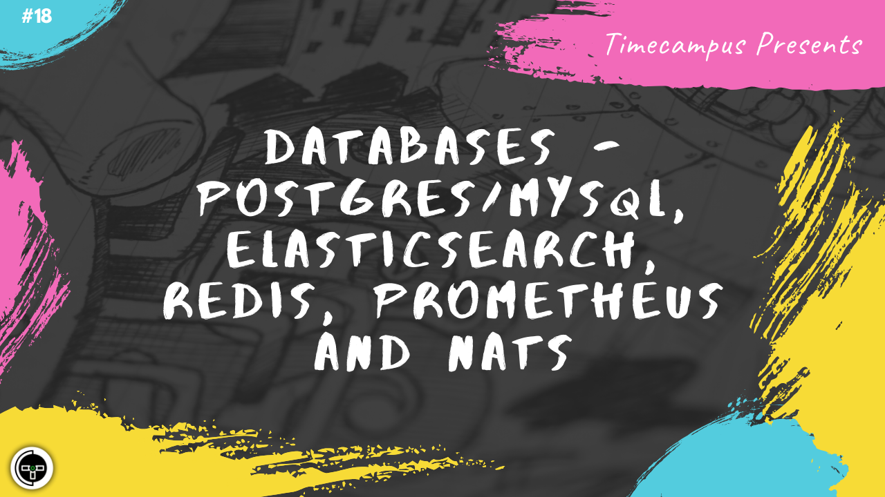

# Episode 18 - Databases - Postgres/MySQL, Elasticsearch, Redis, Prometheus, NATS

This is the 18th episode from the series Never Stop. In this episode, we will look at various databases, how to choose one for your specific use case, the data structure including the pros/cons of each of them. We will specifically be looking at consistent databases like Postgres & MySQL, Search/Time-series oriented databases like Elasticsearch, Caching systems like Redis, Monitoring databases like Prometheus and Event Queues like NATS.

## Schedule

[July 24th 2020, 9:00 PM - 9:45 PM Indian Standard Time (IST)]()

30 minutes for the session, 15 minutes for Q&A and random chat

## Agenda

The agenda of this session are as follows

- [ ] Databases & Types
- [ ] Postgres & MySQL
- [ ] Elasticsearch
- [ ] Redis
- [ ] Prometheus
- [ ] NATS

## Speaker(s)

- [Vignesh T.V.](http://tvvignesh.com/)
