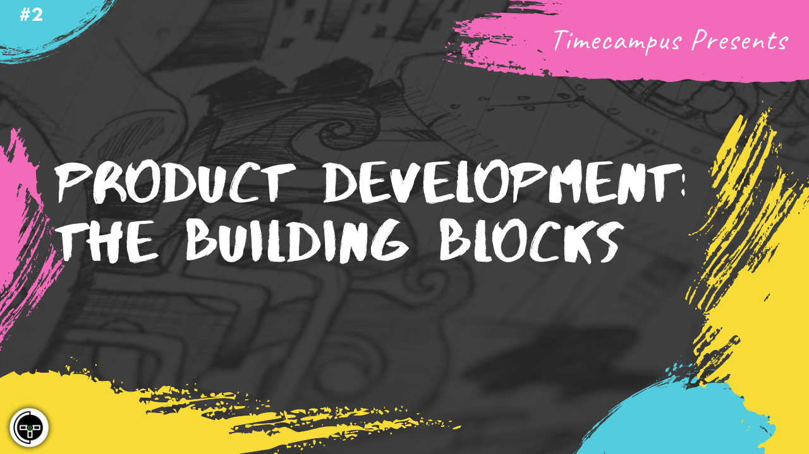

# Episode 2 - Product Development - The Building Blocks

This is the 2nd episode from the series Never Stop. This gives an idea about the Product Development process, the various building blocks on how a Product is taken from an Idea to Delivery. 

We will also talk about the various stakeholders involved, the role they have to play, the various domains supporting the Product Development and how teams are typically structured in Organizations to support product development.

## Schedule

[June 17th 2020, 9:00 PM - 9:45 PM Indian Standard Time (IST)](https://calendar.google.com/event?action=TEMPLATE&tmeid=MGhjam03b28xMHYzZjhwbGVvc2YwcWN1aWwgdGltZWNhbXB1cy5jb21fM2hxNHB0a3MwbGUycm5kMGowMW82MDE0YWdAZw&tmsrc=timecampus.com_3hq4ptks0le2rnd0j01o6014ag%40group.calendar.google.com)

30 minutes for the session, 15 minutes for Q&A and random chat

## Agenda

The agenda of this session are as follows

- [ ] Why, What, How & Who of Product Development
- [ ] Various Stages of Product Development
- [ ] Domains Involved
- [ ] People & Roles

## Speaker(s)

- [Vignesh T.V.](http://tvvignesh.com/)