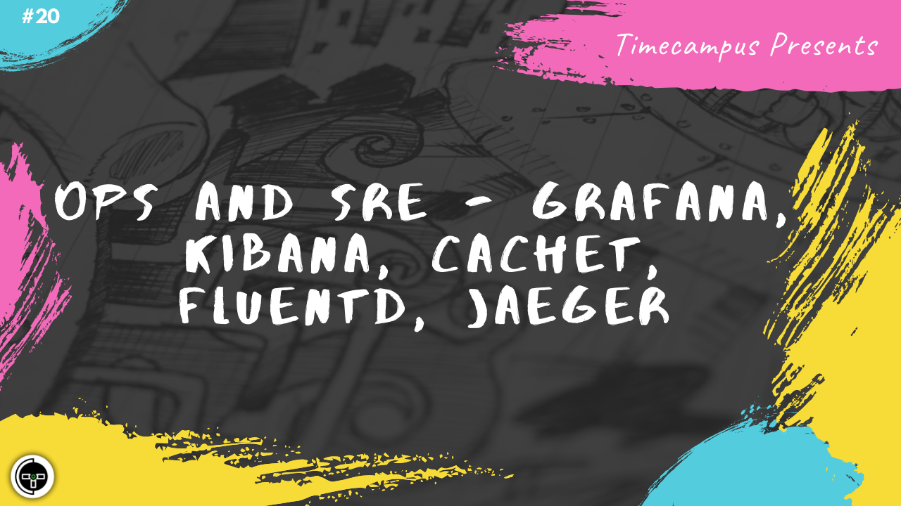

# Episode 20 - OPS & SRE - Grafana, Kibana, Cachet, FluentD, Jaeger

This is the 20th episode from the series Never Stop. It is often critical to have a clear visibility on the infrastructure running to predict and avoid issues or even do a post-mortem analysis of an issue to debug and solve them. Also, monitoring an infrastructure can help in improving the stability and reliability of the infrastructure in place. We will talk about tools like Grafana, Kibana, Cachet, FluentD, Jaeger and how they smoothen OPS & SRE.

## Schedule

[July 29th 2020, 9:00 PM - 9:45 PM Indian Standard Time (IST)]()

30 minutes for the session, 15 minutes for Q&A and random chat

## Agenda

The agenda of this session are as follows

- [ ] OPS & SRE
- [ ] FluentD
- [ ] Jaeger
- [ ] Grafana & Kibana
- [ ] Cachet

## Speaker(s)

- [Vignesh T.V.](http://tvvignesh.com/)
