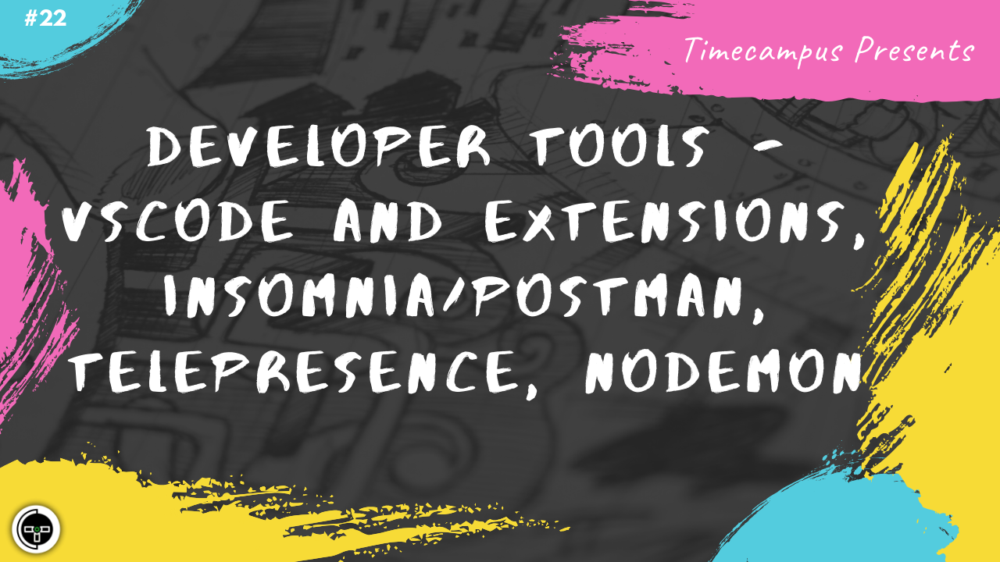

# Episode 22 - Developer Tools - VSCode & Extensions, Insomnia/Postman, Telepresence, Nodemon

This is the 22nd episode from the series Never Stop. When building a product, a developer's productivity is very important and there are a lot of tools which help you along the way and automating as much as you want to automate. We will look at VSCode, VSCode Extensions, Insomnia/Postman, Telepresence, Nodemon and more developer tools which help developers in getting stuff done quicker.

## Schedule

[August 3rd 2020, 9:00 PM - 9:45 PM Indian Standard Time (IST)]()

30 minutes for the session, 15 minutes for Q&A and random chat

## Agenda

The agenda of this session are as follows

- [ ] Developer Tools
- [ ] VSCode & Extensions
- [ ] Insomnia/Postman
- [ ] Telepresence
- [ ] Nodemon

## Speaker(s)

- [Vignesh T.V.](http://tvvignesh.com/)
