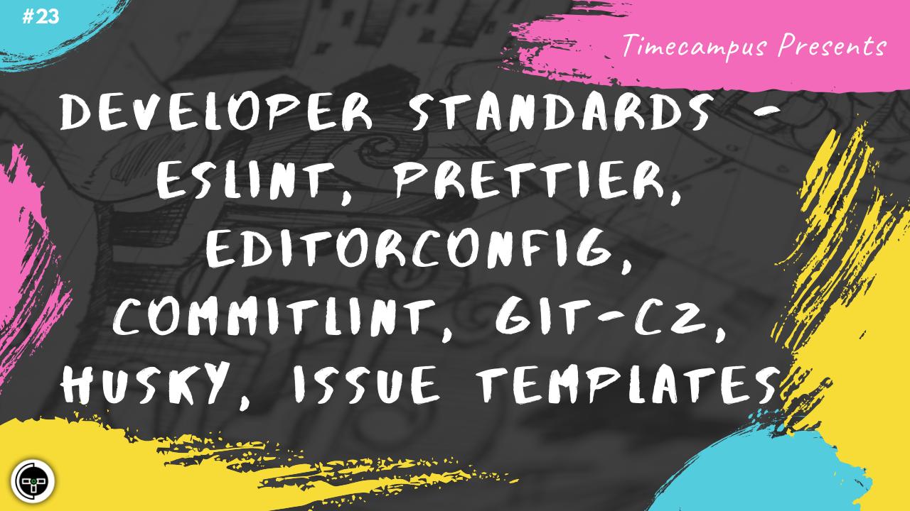

# Episode 23 - Developer Standards - ESLint, Prettier, Editorconfig, Commitlint, git-cz, Husky, Issue Templates

This is the 23rd episode from the series Never Stop. When working in large teams or even with a handful group of people, inconsistencies, mistakes and issues do occur if a consistent standard and convention is not followed. We will see how tools like ESLint, Prettier, Editorconfig, Commitlint, git-cz can be made used to enforce said standards consistently across teams. We will also look at the different kind of standards which make sense to the team.

## Schedule

[August 5th 2020, 9:00 PM - 9:45 PM Indian Standard Time (IST)](https://calendar.google.com/event?action=TEMPLATE&tmeid=MWQ4OTA0cnRocTZiMWoyYjB2YWdtMGQ4aHMgdGltZWNhbXB1cy5jb21fM2hxNHB0a3MwbGUycm5kMGowMW82MDE0YWdAZw&tmsrc=timecampus.com_3hq4ptks0le2rnd0j01o6014ag%40group.calendar.google.com)

30 minutes for the session, 15 minutes for Q&A and random chat

## Agenda

The agenda of this session are as follows

- [ ] Developer Standards
- [ ] ESLint
- [ ] Prettier
- [ ] Editorconfig
- [ ] git-cz & Commitlint
- [ ] Husky
- [ ] Issue Templates

## Resources

[View Slides](#) (Will be available immediately after the session)

[Session Recording](#) (Will be available immediately after the session)

[Article](#) (Will be available immediately after the session)

## Speaker(s)

- [Vignesh T.V.](http://tvvignesh.com/)

------------------------------------------

## Links

[Support us on Patreon](https://www.patreon.com/timecampus)

[Timecampus Alpha Participation](https://docs.google.com/forms/d/1-fHizPhuXqDKqFZ2ns7Ttl00mT13DtjsRbHE5KtpxXs/viewform)

[Timecampus Careers & Internships](https://docs.google.com/forms/d/1jHW-I5yjHl49itwoyM5xxYUao0X1fbnnoxJd78fS5u8/viewform)

[Investors](https://docs.google.com/forms/d/13jkHPdvqoMDNsyzpC8-Dbv0lai8bXOvOLIovey7hfUM/viewform)

[For Consultancy](https://docs.google.com/forms/d/e/1FAIpQLSeCb-Pu7Hcnh7oRvleRka2VW8EVZ6d8cNEccV7jKVmzhE6ilg/viewform)
