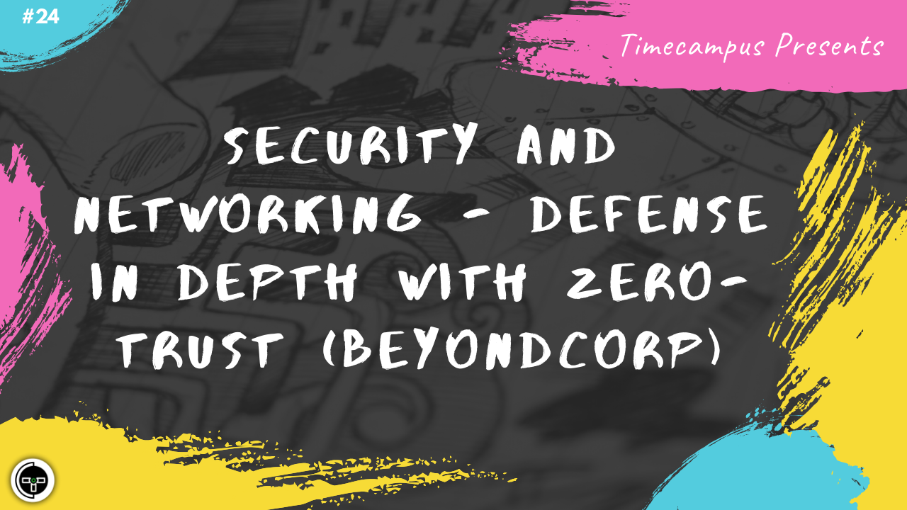

# Episode 24 - Security & Networking - Defense In Depth with Zero-Trust (BeyondCorp)

This is the 24th episode from the series Never Stop. When building a product, security should always be a first class citizen and should not be prioritized for later. We will discuss about Defense In Depth, Zero-Trust security model along with an implementation of the same from Google (a.k.a Beyondcorp), the various principles and how it can be incorporated in our systems.

We will also have a look at the security landscape, the tools and the ecosystem around to make implementation of the same possible.

## Schedule

[August 7th 2020, 9:00 PM - 9:45 PM Indian Standard Time (IST)]()

30 minutes for the session, 15 minutes for Q&A and random chat

## Agenda

The agenda of this session are as follows

- [ ] Security Overview
- [ ] Zero-Trust & Defense In Depth
- [ ] BeyondCorp
- [ ] Principles
- [ ] Implementing Beyondcorp
- [ ] Security Ecosystem

## Speaker(s)

- [Vignesh T.V.](http://tvvignesh.com/)
