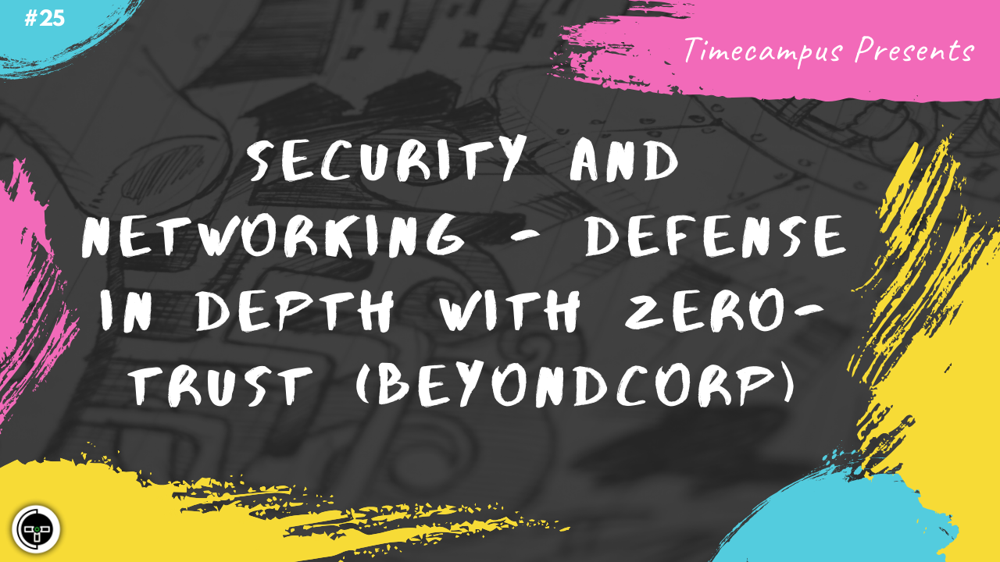

# Episode 25 - Security & Networking - VPC, Shared VPC, Subnets, Cloud NAT, Cloud Router, Cloud IAP, Cloud Armor, Bastion Hosts

This is the 25th episode from the series Never Stop. Setting up the networking infrastructure, VPC, subnets, firewalls, etc. right is very critical to enabling a secure infrastructure. We will discuss about VPC, Shared VPC, Subnets, Cloud NAT, Cloud Router, Cloud IAP, Cloud Armor, Bastion Hosts and how they enable secure networking

## Schedule

[August 10th 2020, 9:00 PM - 9:45 PM Indian Standard Time (IST)]()

30 minutes for the session, 15 minutes for Q&A and random chat

## Agenda

The agenda of this session are as follows

- [ ] Networking Overview
- [ ] VPC, Shared VPC & Subnets
- [ ] Cloud NAT
- [ ] Cloud Router
- [ ] Cloud IAP
- [ ] Cloud Armor
- [ ] Bastion Hosts

## Speaker(s)

- [Vignesh T.V.](http://tvvignesh.com/)
