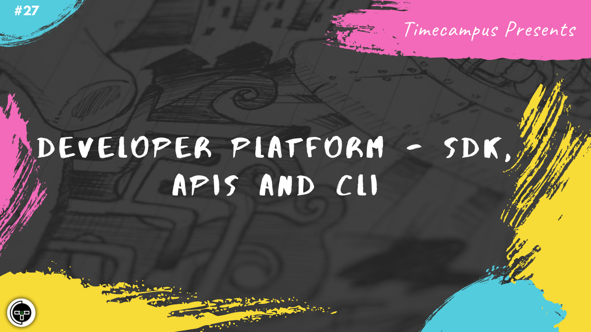

# Episode 27 - Developer Platform - SDK, APIs & CLI

This is the 27th episode from the series Never Stop. Its not often possible to build all the functionalities in the world yourself. So, it is very vital to have a great developer platform with amazing tools for them to work with. We will see how to build a positive experience for them building SDKs, APIs, CLIs which they would need to build on top of the product.

## Schedule

[August 14th 2020, 9:00 PM - 9:45 PM Indian Standard Time (IST)]()

30 minutes for the session, 15 minutes for Q&A and random chat

## Agenda

The agenda of this session are as follows

- [ ] Developer Platform
- [ ] SDK
- [ ] API (Rest/GraphQL)
- [ ] CLI (OClif)
- [ ] Authentication/Authorization

## Speaker(s)

- [Vignesh T.V.](http://tvvignesh.com/)
