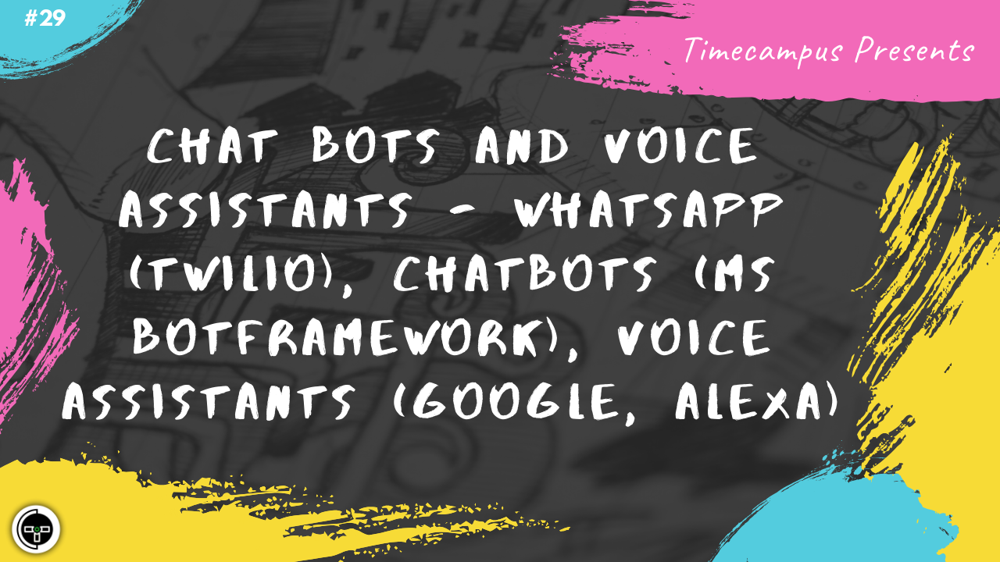

# Episode 29 - Chat Bots & Voice Assistants - Whatsapp (Twilio), Chatbots (MS Botframework), Voice Assistants (Google, Alexa)

This is the 29th episode from the series Never Stop. In this episode, we will see how to build chat bots and voice assistants with cognitive capabilities, how to connect multiple messaging channels like Skype, Facebook, Teams, Whatsapp, etc.

We will explore MS Botframework for Chatbots, Twilio Integration for Whatsapp and Dialogflow for Google Assistant & Alexa

## Schedule

[August 19th 2020, 9:00 PM - 9:45 PM Indian Standard Time (IST)](https://calendar.google.com/event?action=TEMPLATE&tmeid=N2UwdXJvdDdsZDBzcTgzbzBrODEyNThpbmogdGltZWNhbXB1cy5jb21fM2hxNHB0a3MwbGUycm5kMGowMW82MDE0YWdAZw&tmsrc=timecampus.com_3hq4ptks0le2rnd0j01o6014ag%40group.calendar.google.com)

30 minutes for the session, 15 minutes for Q&A and random chat

## Agenda

The agenda of this session are as follows

- [ ] Chatbots & Voice Assistants
- [ ] MS Botframework
- [ ] Whatsapp (Twilio)
- [ ] Voice Assistants (Google, Alexa)

## Resources

[View Slides](#) (Will be available immediately after the session)

[Session Recording](#) (Will be available immediately after the session)

[Article](#) (Will be available immediately after the session)

## Speaker(s)

- [Vignesh T.V.](http://tvvignesh.com/)

------------------------------------------

## Links

[Support us on Patreon](https://www.patreon.com/timecampus)

[Timecampus Alpha Participation](https://docs.google.com/forms/d/1-fHizPhuXqDKqFZ2ns7Ttl00mT13DtjsRbHE5KtpxXs/viewform)

[Timecampus Careers & Internships](https://docs.google.com/forms/d/1jHW-I5yjHl49itwoyM5xxYUao0X1fbnnoxJd78fS5u8/viewform)

[Investors](https://docs.google.com/forms/d/13jkHPdvqoMDNsyzpC8-Dbv0lai8bXOvOLIovey7hfUM/viewform)

[For Consultancy](https://docs.google.com/forms/d/e/1FAIpQLSeCb-Pu7Hcnh7oRvleRka2VW8EVZ6d8cNEccV7jKVmzhE6ilg/viewform)
