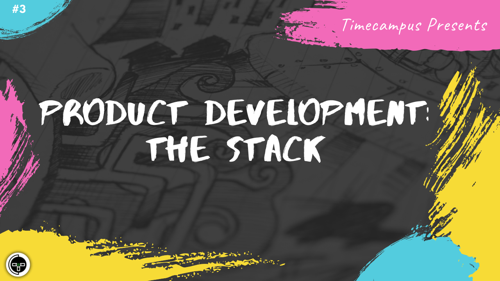

# Episode 3 - Product Development - The Stack

This is the 3rd episode from the series Never Stop. This gives an idea on how to go about deciding the Stack to facilitate the end-end Product Development cycle and the strategy behind choosing the right tool for the right job considering your use case.

There is never a "one size fits all" solution. But there is always a standard procedure you can follow to choose the right tools for your use case and that is what we will talk about.

We will also talk about Agile Development, Front End Channels (Web, App, Bots, Voice, IOT and more), Microservices, Orchestration, CI/CD, Security, Networking, Data (Interface, Transmission, Storage & Retrieval), Testability, Scalability, Elasticity, Third Party Services and everything else you would need to take into consideration when building the product.

## Schedule

[June 19th 2020, 9:00 PM - 9:45 PM Indian Standard Time (IST)](https://calendar.google.com/event?action=TEMPLATE&tmeid=MjN1bzk0ZnF0aGFwbGRjaDB0bjIyMHFqYmsgdGltZWNhbXB1cy5jb21fM2hxNHB0a3MwbGUycm5kMGowMW82MDE0YWdAZw&tmsrc=timecampus.com_3hq4ptks0le2rnd0j01o6014ag%40group.calendar.google.com)

30 minutes for the session, 15 minutes for Q&A and random chat

## Agenda

The agenda of this session are as follows

- [ ] Software Development - Usecase
- [ ] Software Development - Architecture
- [ ] Software Development - Tools
- [ ] Software Development - Third Party Services
- [ ] Software Development - The Full Stack

## Resources

[View Slides](#) (Will be available immediately after the session)

[Session Recording](#) (Will be available immediately after the session)

[Article](#) (Will be available immediately after the session)

## Speaker(s)

- [Vignesh T.V.](http://tvvignesh.com/)

------------------------------------------

## Links

[Support us on Patreon](https://www.patreon.com/timecampus)

[Timecampus Alpha Participation](https://docs.google.com/forms/d/1-fHizPhuXqDKqFZ2ns7Ttl00mT13DtjsRbHE5KtpxXs/viewform)

[Timecampus Careers & Internships](https://docs.google.com/forms/d/1jHW-I5yjHl49itwoyM5xxYUao0X1fbnnoxJd78fS5u8/viewform)

[Investors](https://docs.google.com/forms/d/13jkHPdvqoMDNsyzpC8-Dbv0lai8bXOvOLIovey7hfUM/viewform)

[For Consultancy](https://docs.google.com/forms/d/e/1FAIpQLSeCb-Pu7Hcnh7oRvleRka2VW8EVZ6d8cNEccV7jKVmzhE6ilg/viewform)