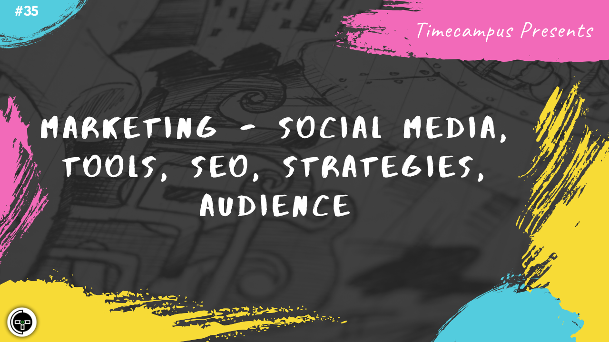

# Episode 35 - Marketing - Social Media, Tools, SEO, Strategies, Audience

This is the 35th episode from the series Never Stop. In this episode, we will look at various Marketing techniques when you are looking at promoting your product to the public for better adoption, better brand recognition, increase in visibility, sales and so on.

We will talk about various strategies businesses follow and also look at some of the tools which enable us to do the same.

## Schedule

[September 2nd 2020, 9:00 PM - 9:45 PM Indian Standard Time (IST)]()

30 minutes for the session, 15 minutes for Q&A and random chat

## Agenda

The agenda of this session are as follows

- [ ] Marketing Techniques
- [ ] Inspirations
- [ ] Social Media
- [ ] Search Engine Optimization
- [ ] Tools

## Speaker(s)

- [Vignesh T.V.](http://tvvignesh.com/)
