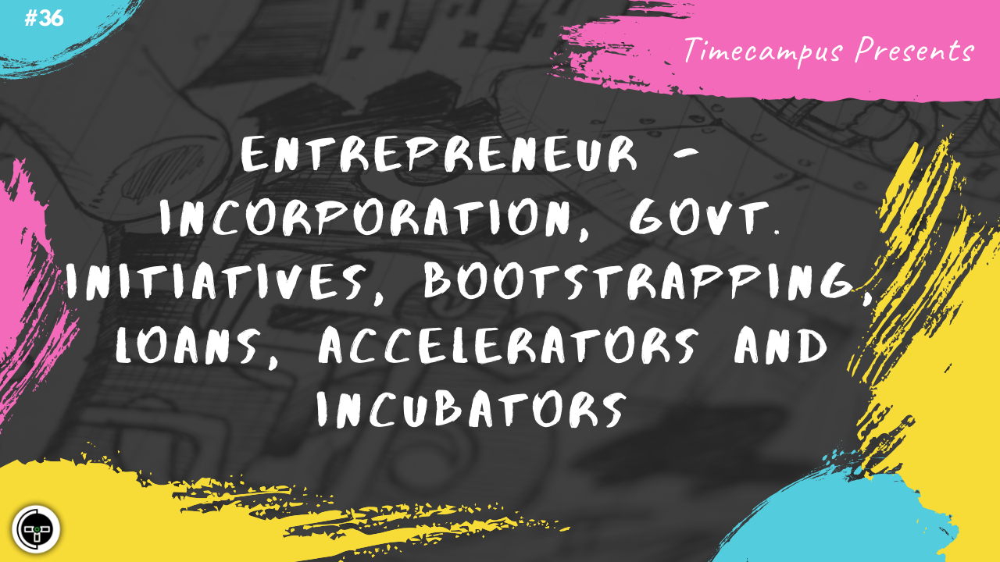

# Episode 36 - Entrepreneur - Incorporation, Govt. Initiatives, Bootstrapping, Loans, Accelerators & Incubators

This is the 36th episode from the series Never Stop. In this episode, we will look at details on how to start a business by incorporating, legal and government formalities, and how to get yourself off the ground with funding yourself through various means like Bootstrapping, Loans, Accelerators & Incubators.

We will also look at various tools and services which help you ease out the work involved.

## Schedule

[September 4th 2020, 9:00 PM - 9:45 PM Indian Standard Time (IST)]()

30 minutes for the session, 15 minutes for Q&A and random chat

## Agenda

The agenda of this session are as follows

- [ ] Incorporation & Formalities
- [ ] Government Initiatives
- [ ] Getting yourself Funded
- [ ] Mentorship
- [ ] Customers

## Speaker(s)

- [Vignesh T.V.](http://tvvignesh.com/)
