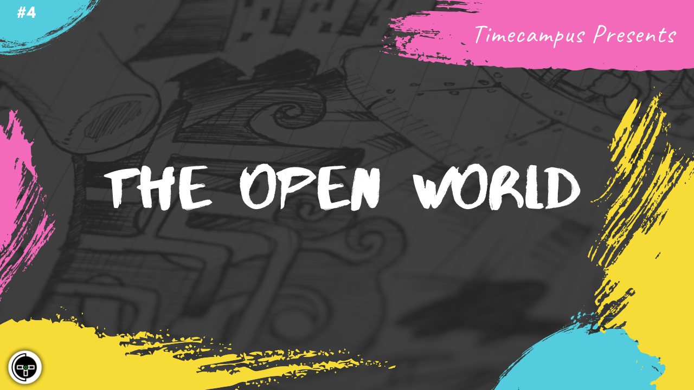

# Episode 4 - The Open World

This is the 4th episode from the series Never Stop. Whether you know it or not, the Open Source World has done a lot for the community. It is very important to learn how some of them work. We will talk about OSS foundations like The Linux Foundation, Apache Software Foundation, Cloud Native Compute Foundation, OpenJS Foundation, Mozilla Foundation, CI Foundation and more.

We will have a look at some of the projects hosted by them, how they work, the governance and licensing model and how such foundations create a sustainable environment for Open Source development along with the various conferences they host. We will dive deep.

## Schedule

[June 22nd 2020, 9:00 PM - 9:45 PM Indian Standard Time (IST)](https://calendar.google.com/event?action=TEMPLATE&tmeid=MTUwcGIyZzFoNGdpcWRudmRucXZ0aWM3OXQgdGltZWNhbXB1cy5jb21fM2hxNHB0a3MwbGUycm5kMGowMW82MDE0YWdAZw&tmsrc=timecampus.com_3hq4ptks0le2rnd0j01o6014ag%40group.calendar.google.com)

30 minutes for the session, 15 minutes for Q&A and random chat

## Agenda

The agenda of this session are as follows

- [ ] About OSS Foundations
- [ ] The Apache Software Foundation
- [ ] The Linux Foundation
- [ ] Cloud Native Compute Foundation
- [ ] OpenJS Foundation
- [ ] Mozilla Foundation
- [ ] CI Foundation
- [ ] Governance
- [ ] Licensing
- [ ] Conferences

## Speaker(s)

- [Vignesh T.V.](http://tvvignesh.com/)
