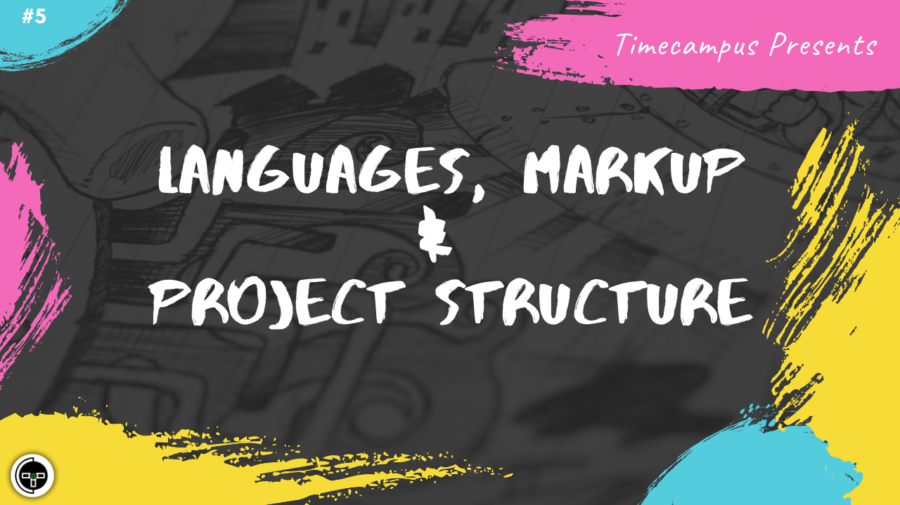

# Episode 5 - Languages, Markup & Project Structure - HTML, CSS, Javascript, Typescript, Markdown, etc.

This is the 5th episode from the series Never Stop. Now that we have talked about the stack and open source ecosystem in the previous episodes, we will now talk about various scripting & markup languages like HTML, CSS, Javascript, Typescript, Markdown.

We will also talk about the strategy behind deciding the Project structure

## Schedule

[June 24th 2020, 9:00 PM - 9:45 PM Indian Standard Time (IST)](https://calendar.google.com/event?action=TEMPLATE&tmeid=MGg2b3NybmVjbWxtMm1iaWpudnBsN283cjQgdGltZWNhbXB1cy5jb21fM2hxNHB0a3MwbGUycm5kMGowMW82MDE0YWdAZw&tmsrc=timecampus.com_3hq4ptks0le2rnd0j01o6014ag%40group.calendar.google.com)

30 minutes for the session, 15 minutes for Q&A and random chat

## Agenda

The agenda of this session are as follows

- [ ] About OSS Foundations
- [ ] The Apache Software Foundation
- [ ] The Linux Foundation
- [ ] Cloud Native Compute Foundation
- [ ] OpenJS Foundation
- [ ] Mozilla Foundation
- [ ] CI Foundation
- [ ] Governance
- [ ] Licensing
- [ ] Conferences

## Speaker(s)

- [Vignesh T.V.](http://tvvignesh.com/)
