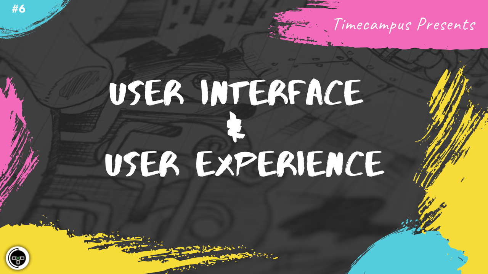

# Episode 6 - User Interface & User Experience

This is the 6th episode from the series Never Stop. A good User Interface & a great User Experience are very much essential for your product's success. In this episode, we will talk about Design principles & Design Systems including things like Material Design, Responsive Applications, Usability, Accessibility, Performance and Progressive Web Apps.

## Schedule

[June 26th 2020, 9:00 PM - 9:45 PM Indian Standard Time (IST)](https://calendar.google.com/event?action=TEMPLATE&tmeid=NGY3dTlpNzJ1ZzF0MzQydmtpY2tocmR1cW8gdGltZWNhbXB1cy5jb21fM2hxNHB0a3MwbGUycm5kMGowMW82MDE0YWdAZw&tmsrc=timecampus.com_3hq4ptks0le2rnd0j01o6014ag%40group.calendar.google.com)

30 minutes for the session, 15 minutes for Q&A and random chat

## Agenda

The agenda of this session are as follows

- [ ] Designing a great User Interface
- [ ] Designing for an amazing User Experience
- [ ] Design Systems - Material Design
- [ ] Responsive Design
- [ ] Usability, Accessibility & Performance
- [ ] Progressive Web Apps

## Speaker(s)

- [Vignesh T.V.](http://tvvignesh.com/)
