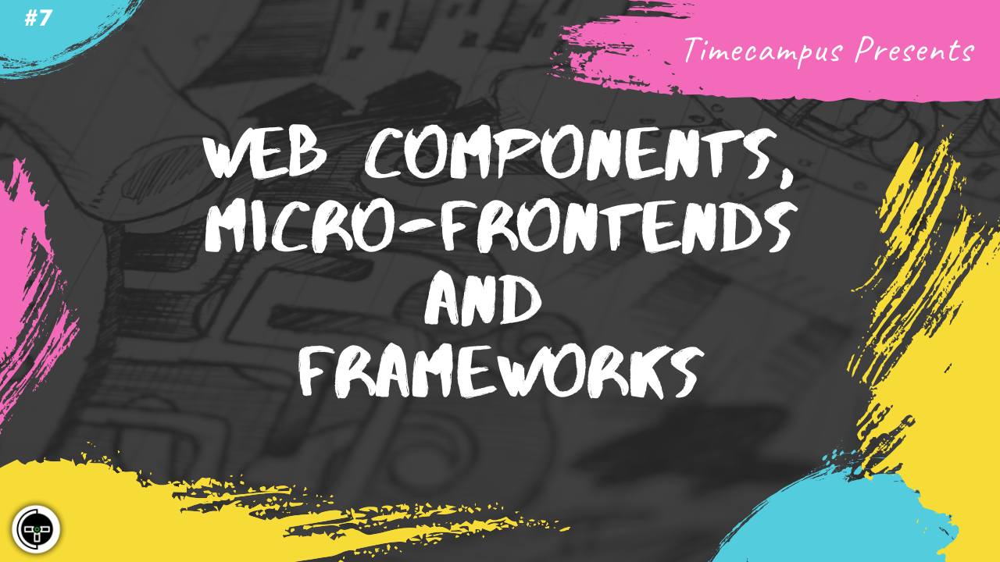

# Episode 7 - Web Components, Micro-Frontends and Frameworks

This is the 7th episode from the series Never Stop. Webcomponents bring a lot of benefits including re-usability, standardization, scoping, interoperability, etc. and when used with Frameworks like Lit Elements or Stencil/IONIC it becomes even more powerful and interesting. We will see about Web components, Micro-FrontEnds Lit Elements, IONIC & Open WC in this session

## Schedule

[June 29th 2020, 9:00 PM - 9:45 PM Indian Standard Time (IST)](https://calendar.google.com/event?action=TEMPLATE&tmeid=NDNoZmduYW5yMnVwZzUyMGY1aDNpdW8waTAgdGltZWNhbXB1cy5jb21fM2hxNHB0a3MwbGUycm5kMGowMW82MDE0YWdAZw&tmsrc=timecampus.com_3hq4ptks0le2rnd0j01o6014ag%40group.calendar.google.com)

30 minutes for the session, 15 minutes for Q&A and random chat

## Agenda

The agenda of this session are as follows

- [ ] Web Components
- [ ] Micro-FrontEnds
- [ ] Lit Elements
- [ ] IONIC
- [ ] OpenWC

## Speaker(s)

- [Vignesh T.V.](http://tvvignesh.com/)
