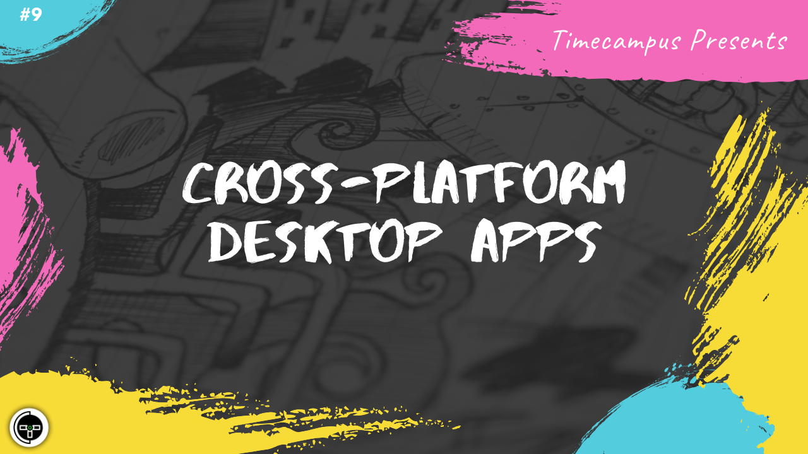

# Episode 9 - Cross-Platform Desktop Apps

This is the 9th episode from the series Never Stop. While we can end-up spending a lot of time trying to build software individually to support every platform, it is often advisable to go for a cross-platform approach using tools platforms like Electron so that you can build once and run everywhere. In this episode, we will talk about Electron, Electron Forge, Electron Release Server and more to do with cross-platform desktop application development

## Schedule

[July 3rd 2020, 9:00 PM - 9:45 PM Indian Standard Time (IST)](https://calendar.google.com/event?action=TEMPLATE&tmeid=NTM4dm1lb2l2ZmxwMHV2OW9uZzlydmowNXQgdGltZWNhbXB1cy5jb21fM2hxNHB0a3MwbGUycm5kMGowMW82MDE0YWdAZw&tmsrc=timecampus.com_3hq4ptks0le2rnd0j01o6014ag%40group.calendar.google.com)

30 minutes for the session, 15 minutes for Q&A and random chat

## Agenda

The agenda of this session are as follows

- [ ] Cross-platform Desktop Apps
- [ ] Electron
- [ ] Electron Forge
- [ ] Electron Update/Release Server

## Speaker(s)

- [Vignesh T.V.](http://tvvignesh.com/)
