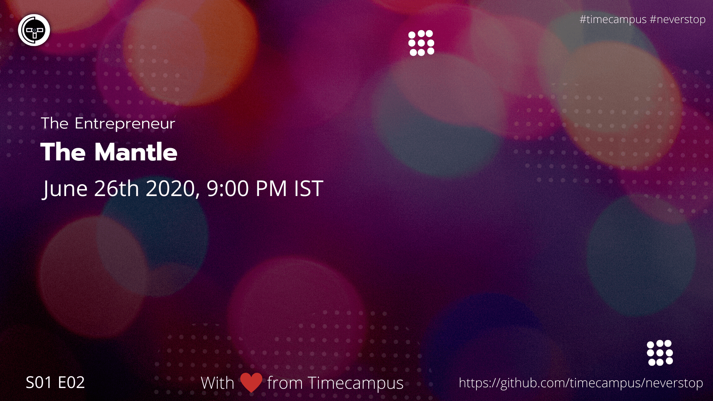

# The Entrepreneur S01E02 - The Mantle

In this episode, we will be giving you an idea about all the challenges which an entrepreneur would typically face during his/her journey and how you would go about overcoming all of them.

## Stream Links

Youtube: https://www.youtube.com/watch?v=BeYFj96f03s

Facebook: https://www.facebook.com/timecampustech/live/

Twitch: https://www.twitch.tv/timecampus

Mixer: https://mixer.com/timecampus

Periscope: https://periscope.tv/timecampus

Smashcast: https://www.smashcast.tv/timecampus

## Schedule

[June 26th 2020, 9:00 PM - 9:30 PM Indian Standard Time (IST)](https://calendar.google.com/event?action=TEMPLATE&tmeid=MjlrbzloN2lhcGtkdmJnb2J1MnRvZ2R0OTdfMjAyMDA2MjZUMTUzMDAwWiB0aW1lY2FtcHVzLmNvbV8zaHE0cHRrczBsZTJybmQwajAxbzYwMTRhZ0Bn&tmsrc=timecampus.com_3hq4ptks0le2rnd0j01o6014ag%40group.calendar.google.com)

30 minutes for the session, Q&A in the middle

## Agenda

The agenda of this session are as follows

- [ ] The Road Not Taken
- [ ] Switching Careers
- [ ] Time Management - Work-Life Balance & Health
- [ ] Passion, Motivation, Courage & Accountability
- [ ] Avoiding the Guilt
- [ ] The Breaking Point & Grit
- [ ] Capital, Cash-flow & Profit
- [ ] Hiring the “right” team
- [ ] The “right” market
- [ ] Stagnation
- [ ] Competition
- [ ] The Unknowns
- [ ] Government & Legal challenges
- [ ] The Attitude

## Resources

[View Slides](https://docs.google.com/presentation/d/1QJ6jazVCUZiQrUmqZaORksSP1cXXtkXTpnRsRiZOQWY/edit?usp=sharing)

## Speaker(s)

- [Vignesh T.V.](http://tvvignesh.com/)