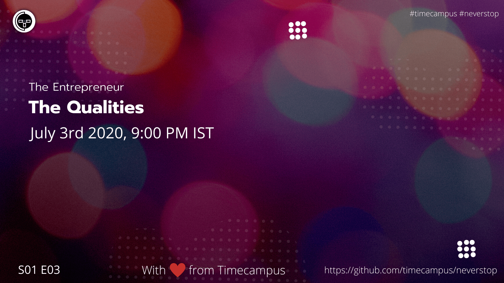

# The Entrepreneur S01E03 - The Qualities

In this episode, we will be giving you an idea about all the ideal qualities of an entrepreneur, how his/her attitude should be to setup yourself for success.

## Stream Links

Youtube: https://www.youtube.com/watch?v=aansjN3j7RM

Facebook: https://www.facebook.com/timecampustech/live/

Twitch: https://www.twitch.tv/timecampus

Mixer: https://mixer.com/timecampus

Periscope: https://periscope.tv/timecampus

Smashcast: https://www.smashcast.tv/timecampus

## Schedule

[July 3rd 2020, 9:00 PM - 9:30 PM Indian Standard Time (IST)](https://calendar.google.com/event?action=TEMPLATE&tmeid=MjlrbzloN2lhcGtkdmJnb2J1MnRvZ2R0OTdfMjAyMDA3MDNUMTUzMDAwWiB0aW1lY2FtcHVzLmNvbV8zaHE0cHRrczBsZTJybmQwajAxbzYwMTRhZ0Bn&tmsrc=timecampus.com_3hq4ptks0le2rnd0j01o6014ag%40group.calendar.google.com)

30 minutes for the session, Q&A in the middle

## Agenda

The agenda of this session are as follows

- [ ] Passion & Motivation
- [ ] Self-Discipline & Time Management
- [ ] Confidence
- [ ] Open Mindedness
- [ ] Competitiveness
- [ ] Creativity
- [ ] Integrity
- [ ] Persistence
- [ ] Patience
- [ ] Direction
- [ ] Decisiveness & Risk-taking ability
- [ ] Outcome oriented
- [ ] People Skills
- [ ] Leadership Skills
- [ ] Emotional tolerance
- [ ] Conflict resolution skill
- [ ] Organizing skill

## Resources

[View Slides](https://docs.google.com/presentation/d/1RVr94EJVMAi0LBWmqAzmhrK7pQ5SM72ozEF4fS8I1Uc/edit?usp=sharing)

## Speaker(s)

- [Vignesh T.V.](http://tvvignesh.com/)