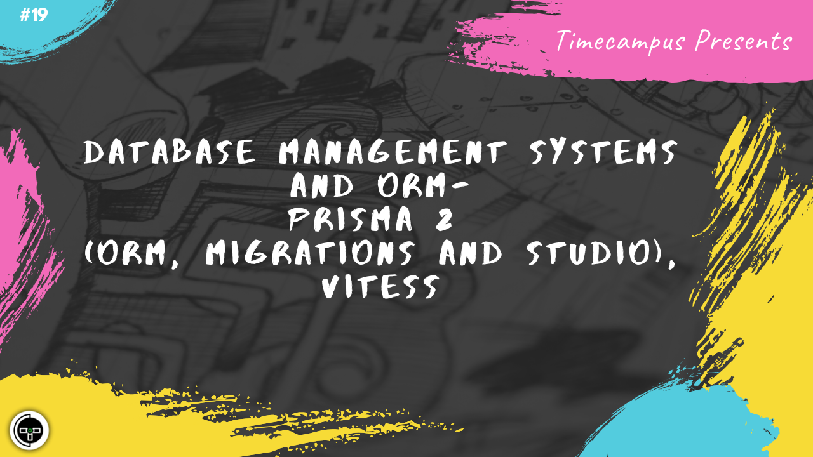

# Episode 19 - Database Management Systems & ORM - Prisma 2 (ORM, Migrations & Studio), Vitess

This is the 19th episode from the series Never Stop. In this episode, we will look at how most of the complexity of managing and working with databases can be avoided by choosing management systems & ORM, doing database migrations, backups, failover, multi-region databases, clustering, schema definition, interoperability etc. using tools like Prisma 2 and Vitess.

## Schedule

[July 27th 2020, 9:00 PM - 9:45 PM Indian Standard Time (IST)](https://calendar.google.com/event?action=TEMPLATE&tmeid=NGQ4NnN1N3ZjcmZhbXBxbG9tOW1wYm0yZGkgdGltZWNhbXB1cy5jb21fM2hxNHB0a3MwbGUycm5kMGowMW82MDE0YWdAZw&tmsrc=timecampus.com_3hq4ptks0le2rnd0j01o6014ag%40group.calendar.google.com)

30 minutes for the session, 15 minutes for Q&A and random chat

## Agenda

The agenda of this session are as follows

- [ ] Managing Databases
- [ ] Scaling, Multi-region, Optimizing
- [ ] Prisma 2 Engine
- [ ] Prisma 2 Migration
- [ ] Prisma 2 Studio
- [ ] Vitess

## Resources

[View Slides](#) (Will be available immediately after the session)

[Session Recording](#) (Will be available immediately after the session)

[Article](#) (Will be available immediately after the session)

## Speaker(s)

- [Vignesh T.V.](http://tvvignesh.com/)

------------------------------------------

## Links

[Support us on Patreon](https://www.patreon.com/timecampus)

[Timecampus Alpha Participation](https://docs.google.com/forms/d/1-fHizPhuXqDKqFZ2ns7Ttl00mT13DtjsRbHE5KtpxXs/viewform)

[Timecampus Careers & Internships](https://docs.google.com/forms/d/1jHW-I5yjHl49itwoyM5xxYUao0X1fbnnoxJd78fS5u8/viewform)

[Investors](https://docs.google.com/forms/d/13jkHPdvqoMDNsyzpC8-Dbv0lai8bXOvOLIovey7hfUM/viewform)

[For Consultancy](https://docs.google.com/forms/d/e/1FAIpQLSeCb-Pu7Hcnh7oRvleRka2VW8EVZ6d8cNEccV7jKVmzhE6ilg/viewform)
