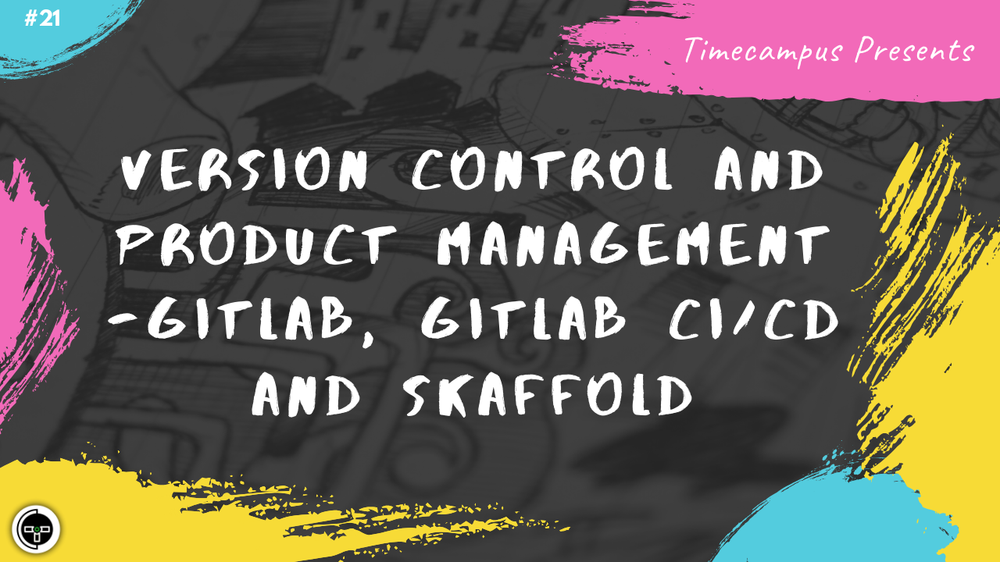

# Episode 21 - Version Control & Product Management - Gitlab, Gitlab CI/CD & Skaffold

This is the 21st episode from the series Never Stop. When building a product, it is very critical to have a very good version control system in place, a good issue tracker, milestones, tags/labels, priorities, CI/CD, security, etc. to make sure we have everything at one place, organized, secured, collaborative and at the same time, many tasks are automated taking the pain off from the developers. We will see how a good version control system and a good CI/CD workflow enables that. We will look at Gitlab's various features including version control, how CI/CD pipelines can be well defined, along with tools like Skaffold to smoothen the process.

## Schedule

[July 31st 2020, 9:00 PM - 9:45 PM Indian Standard Time (IST)](https://calendar.google.com/event?action=TEMPLATE&tmeid=N25nbGRlZjE4MDYxMnY3bnRlOTRhMjY2ZGcgdGltZWNhbXB1cy5jb21fM2hxNHB0a3MwbGUycm5kMGowMW82MDE0YWdAZw&tmsrc=timecampus.com_3hq4ptks0le2rnd0j01o6014ag%40group.calendar.google.com)

30 minutes for the session, 15 minutes for Q&A and random chat

## Agenda

The agenda of this session are as follows

- [ ] Version Control Systems
- [ ] GIT Flow
- [ ] Gitlab
- [ ] Gitlab CI/CD
- [ ] Skaffold

## Resources

[View Slides](#) (Will be available immediately after the session)

[Session Recording](#) (Will be available immediately after the session)

[Article](#) (Will be available immediately after the session)

## Speaker(s)

- [Vignesh T.V.](http://tvvignesh.com/)

------------------------------------------

## Links

[Support us on Patreon](https://www.patreon.com/timecampus)

[Timecampus Alpha Participation](https://docs.google.com/forms/d/1-fHizPhuXqDKqFZ2ns7Ttl00mT13DtjsRbHE5KtpxXs/viewform)

[Timecampus Careers & Internships](https://docs.google.com/forms/d/1jHW-I5yjHl49itwoyM5xxYUao0X1fbnnoxJd78fS5u8/viewform)

[Investors](https://docs.google.com/forms/d/13jkHPdvqoMDNsyzpC8-Dbv0lai8bXOvOLIovey7hfUM/viewform)

[For Consultancy](https://docs.google.com/forms/d/e/1FAIpQLSeCb-Pu7Hcnh7oRvleRka2VW8EVZ6d8cNEccV7jKVmzhE6ilg/viewform)
