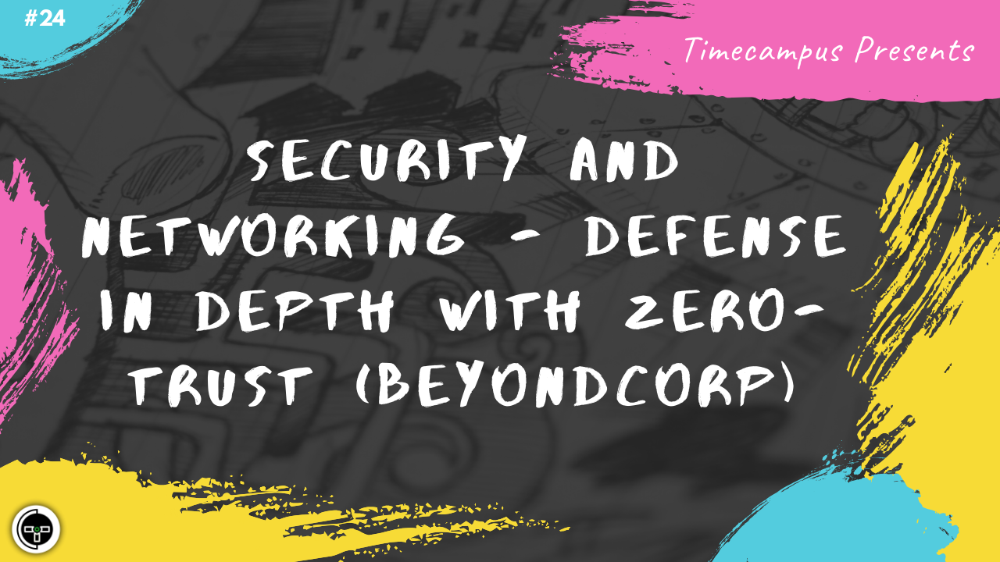

# Episode 24 - Security & Networking - Defense In Depth with Zero-Trust (BeyondCorp)

This is the 24th episode from the series Never Stop. When building a product, security should always be a first class citizen and should not be prioritized for later. We will discuss about Defense In Depth, Zero-Trust security model along with an implementation of the same from Google (a.k.a Beyondcorp), the various principles and how it can be incorporated in our systems.

We will also have a look at the security landscape, the tools and the ecosystem around to make implementation of the same possible.

## Schedule

[August 7th 2020, 9:00 PM - 9:45 PM Indian Standard Time (IST)](https://calendar.google.com/event?action=TEMPLATE&tmeid=NjUwNWxvYWltMmM1bHUxZnF1NTVvcWUyajAgdGltZWNhbXB1cy5jb21fM2hxNHB0a3MwbGUycm5kMGowMW82MDE0YWdAZw&tmsrc=timecampus.com_3hq4ptks0le2rnd0j01o6014ag%40group.calendar.google.com)

30 minutes for the session, 15 minutes for Q&A and random chat

## Agenda

The agenda of this session are as follows

- [ ] Security Overview
- [ ] Zero-Trust & Defense In Depth
- [ ] BeyondCorp
- [ ] Principles
- [ ] Implementing Beyondcorp
- [ ] Security Ecosystem

## Resources

[View Slides](#) (Will be available immediately after the session)

[Session Recording](#) (Will be available immediately after the session)

[Article](#) (Will be available immediately after the session)

## Speaker(s)

- [Vignesh T.V.](http://tvvignesh.com/)

------------------------------------------

## Links

[Support us on Patreon](https://www.patreon.com/timecampus)

[Timecampus Alpha Participation](https://docs.google.com/forms/d/1-fHizPhuXqDKqFZ2ns7Ttl00mT13DtjsRbHE5KtpxXs/viewform)

[Timecampus Careers & Internships](https://docs.google.com/forms/d/1jHW-I5yjHl49itwoyM5xxYUao0X1fbnnoxJd78fS5u8/viewform)

[Investors](https://docs.google.com/forms/d/13jkHPdvqoMDNsyzpC8-Dbv0lai8bXOvOLIovey7hfUM/viewform)

[For Consultancy](https://docs.google.com/forms/d/e/1FAIpQLSeCb-Pu7Hcnh7oRvleRka2VW8EVZ6d8cNEccV7jKVmzhE6ilg/viewform)
