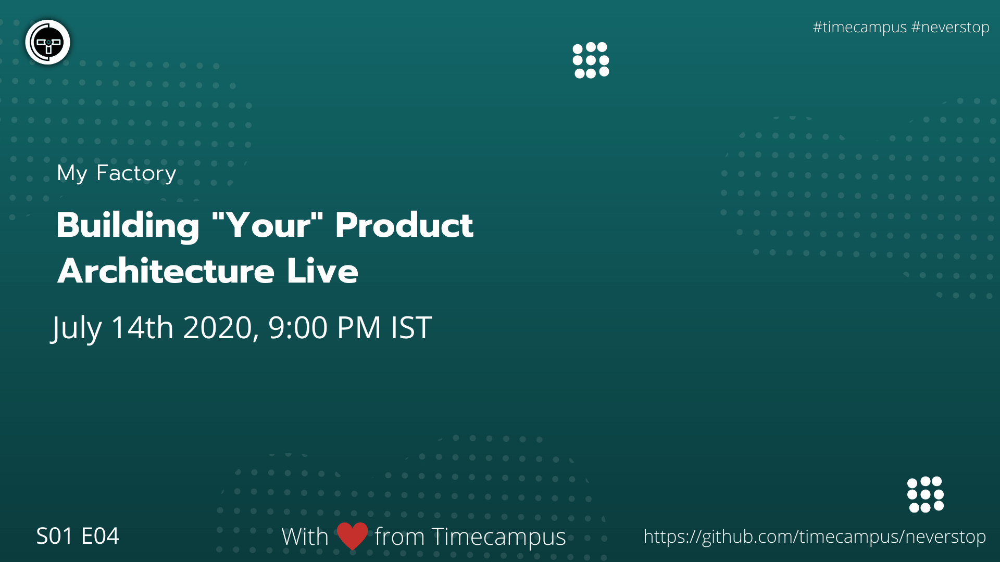

# My Factory S01E04

In this episode, we will be architecting Facebook live in the stream.

## Stream Links

Youtube: https://www.youtube.com/watch?v=lPEp6HNFDFA

Facebook: https://www.facebook.com/timecampustech/live/

Twitch: https://www.twitch.tv/timecampus

Periscope: https://periscope.tv/timecampus

Smashcast: https://www.smashcast.tv/timecampus

## Schedule

[July 14th 2020, 9:00 PM - 9:30 PM Indian Standard Time (IST)](https://calendar.google.com/event?action=TEMPLATE&tmeid=MmNrY2x1bnZjOXEwOHExNnNndGZwODBhOWFfMjAyMDA3MTRUMTUzMDAwWiB0aW1lY2FtcHVzLmNvbV8zaHE0cHRrczBsZTJybmQwajAxbzYwMTRhZ0Bn&tmsrc=timecampus.com_3hq4ptks0le2rnd0j01o6014ag%40group.calendar.google.com)

20 minutes for the session, 10 minutes for Q&A and random chat

## Agenda

The agenda of this session are as follows

- [ ] The Problem Statement
- [ ] Constraints
- [ ] Research
- [ ] Solution
- [ ] Validation
- [ ] Iterations

## Resources

[View Slides](https://docs.google.com/presentation/d/1hGh-kBsBG8jJIg_0X7blbl28ATKRircjDE6Ccgf6mYA/edit?usp=sharing)

[Diagram](https://drive.google.com/file/d/1RXGFX8mYjDfOzv5rQJrV98xqW-YT9zbV/view?usp=sharing)

## Speaker(s)

- [Vignesh T.V.](http://tvvignesh.com/)