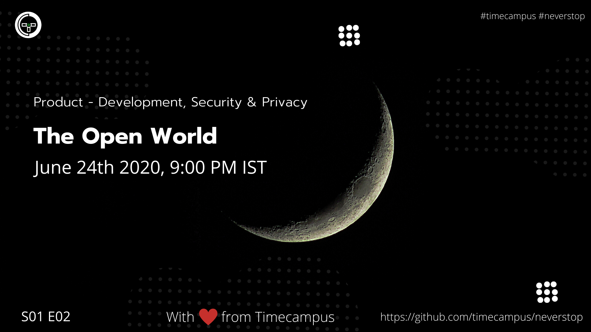

# Product Development S01E02 - The Open World

In this episode, we will look at Open source software and various foundations and organizations which become its pillars of sustainability and growth. We will also look at things like Governance, Licensing, Funding, and also see some of the OSS Events, Conferences & Programmes organized around the world. In addition to this, we will also tell you what it means to be a part of OSS Community and how to be a part of it.

## Stream Links

Youtube: https://www.youtube.com/watch?v=PZw1BK1z6Mc

Facebook: https://www.facebook.com/timecampustech/videos/268966667525673/

Twitch: https://www.twitch.tv/timecampus

Periscope: https://periscope.tv/timecampus

Smashcast: https://www.smashcast.tv/timecampus

## Schedule

[June 24th 2020, 9:00 PM - 9:30 PM Indian Standard Time (IST)](https://calendar.google.com/event?action=TEMPLATE&tmeid=MGpxN3ZxaG51cHE2cTJnN2xnM3BmZWttNzlfMjAyMDA2MjRUMTUzMDAwWiB0aW1lY2FtcHVzLmNvbV8zaHE0cHRrczBsZTJybmQwajAxbzYwMTRhZ0Bn&tmsrc=timecampus.com_3hq4ptks0le2rnd0j01o6014ag%40group.calendar.google.com&scp=ALL)

20 minutes for the session, 10 minutes for Q&A and random chat

## Agenda

The agenda of this session are as follows

- [ ] Open Source Software
- [ ] OSS Foundations
- [ ] OSS Orgs
- [ ] OSS Governance
- [ ] OSS Licensing
- [ ] OSS Funding
- [ ] OSS Events, Conferences & Programmes
- [ ] OSS Education
- [ ] Ask Me Anything

## Resources

[View Slides](https://docs.google.com/presentation/d/1M15XgiTULEACBGHE84JfNaQCr6WjuXnCQ7k7AxkYD-A/edit?usp=sharing)

## Speaker(s)

- [Vignesh T.V.](http://tvvignesh.com/)