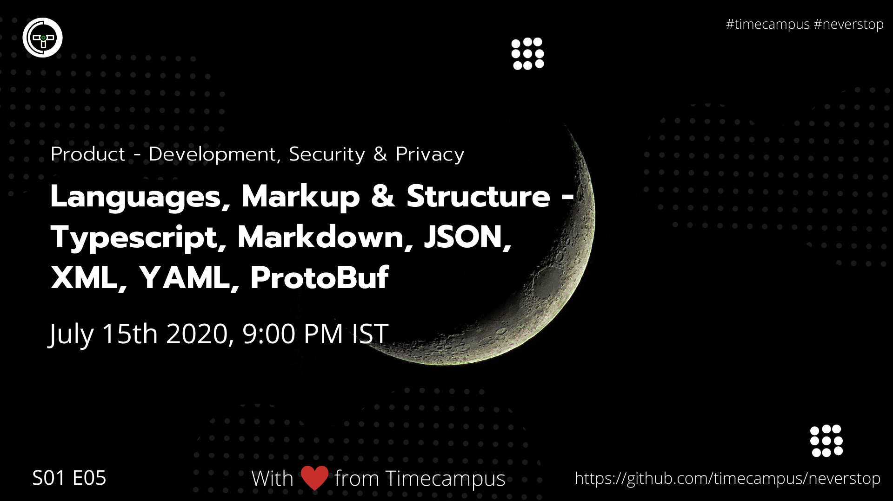

# Product Development S01E05 - Languages, Markup & Structure Part 2

In this episode, we will look at how to go about choosing the right tech stack depending on our usecase and architecture. We will dive deep on what to keep into account when deciding the right tool or software for you with practical examples.

## Stream Links

Youtube: https://www.youtube.com/watch?v=AXBJjNYcCww

Facebook: https://www.facebook.com/timecampustech/live/

Twitch: https://www.twitch.tv/timecampus

Periscope: https://periscope.tv/timecampus

Smashcast: https://www.smashcast.tv/timecampus

## Schedule

[July 15th 2020, 9:00 PM - 9:30 PM Indian Standard Time (IST)](https://calendar.google.com/event?action=TEMPLATE&tmeid=MGpxN3ZxaG51cHE2cTJnN2xnM3BmZWttNzlfMjAyMDA3MTVUMTUzMDAwWiB0aW1lY2FtcHVzLmNvbV8zaHE0cHRrczBsZTJybmQwajAxbzYwMTRhZ0Bn&tmsrc=timecampus.com_3hq4ptks0le2rnd0j01o6014ag%40group.calendar.google.com)

20 minutes for the session, 10 minutes for Q&A and random chat

## Agenda

The agenda of this session are as follows

- [ ] Typescript
- [ ] Markdown
- [ ] JSON
- [ ] XML
- [ ] YAML
- [ ] ProtoBuf
- [ ] JSX

## Resources

[View Slides](https://docs.google.com/presentation/d/1r2TaW4I47GgWq6efuoEtaXe0aa0Xg0puR5I2QKZ0krU/edit?usp=sharing)

## References

https://www.typescriptlang.org/

https://guides.github.com/features/mastering-markdown/

https://www.w3schools.com/js/js_json_intro.asp

https://www.w3schools.com/xml/xml_whatis.asp

https://www.tutorialspoint.com/yaml/

https://developers.google.com/protocol-buffers

https://reactjs.org/docs/introducing-jsx.html

https://mdxjs.com/

## Speaker(s)

- [Vignesh T.V.](http://tvvignesh.com/)