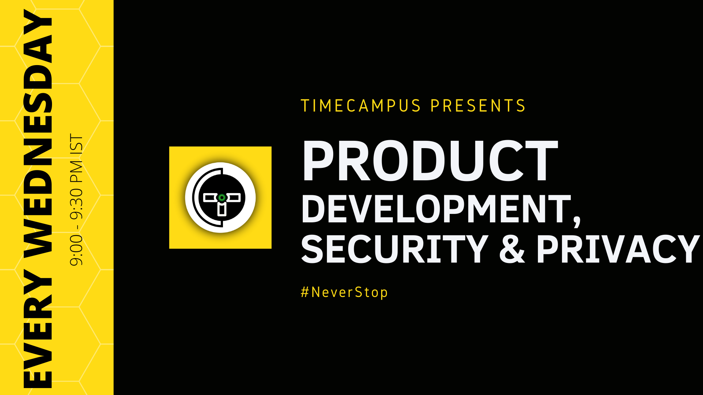

import Jump from '@site/src/components/Jump';
import Alert from '@site/src/components/Alert';

## Seasons

- [Seasons](#seasons)
    - [Season 1](#season-1)
    - [Season 2](#season-2)
    - [Season 3](#season-3)
    - [Season 4](#season-4)
    - [Season 5](#season-5)

#### Season 1

1. [The Usecase & Architecture](Season-1/PD-S01E01/README.md)

2. [The Open World](Season-1/PD-S01E02/README.md)

3. [The Stack](Season-1/PD-S01E03/README.md)

4. [Languages, Markup & Structure - HTML, CSS, JS](Season-1/PD-S01E04/README.md)

5. [Languages, Markup & Structure - Typescript, Markdown](Season-1/PD-S01E05/README.md)

6. [The Client Side Framework Battle](Season-1/PD-S01E06/README.md)

7. [Web Components & Micro-Frontends](Season-1/PD-S01E07/README.md)

8. [Front End Development Tools](Season-1/PD-S01E08/README.md)

9. [Cross-Platform Desktop Apps](Season-1/PD-S01E09/README.md)

10. [Mobile App Development](Season-1/PD-S01E10/README.md)

11. [Cordova, Capacitor & IONIC](Season-1/PD-S01E11/README.md)

12. [Extensions - Chrome, Firefox, VSCode](Season-1/PD-S01E12/README.md)

#### Season 2

1. [Server Side Development](Season-2/PD-S02E01/README.md)

2. [Microservices, Modelling & Principles](Season-2/PD-S02E02/README.md)

3. [Containers & Orchestration](Season-2/PD-S02E03/README.md)

4. [Server Side Languages, Frameworks](Season-2/PD-S02E04/README.md)

5. [Databases - Postgres/MySQL, Elasticsearch](Season-2/PD-S02E05/README.md)

6. [Databases - Redis, NATS, Prometheus](Season-2/PD-S02E06/README.md)

7. [Prisma 2 (ORM, Migrations & Studio)](Season-2/PD-S02E07/README.md)

8. [Vitess & Multi-Region Databases](Season-2/PD-S02E08/README.md)

9. [OPS & SRE - Grafana, Kibana, Cachet](Season-2/PD-S02E09/README.md)

10. [OPS & SRE - FluentD, Jaeger, OpenTelemetry](Season-2/PD-S02E10/README.md)

11. [Version Control & Workflows](Season-2/PD-S02E11/README.md)

12. [Package Managers & Registries - NPM, YARN & Verdaccio](Season-2/PD-S02E12/README.md)

#### Season 3

1. [Infrastructure, Cloud & Infrastructure as Code](Season-2/PD-S03E01/README.md)

2. [Kubernetes - Part 1](Season-3/PD-S03E02/README.md)

3. [Kubernetes - Part 2](Season-3/PD-S03E03/README.md)

4. [Helm](Season-3/PD-S03E04/README.md)

5. [OCI, Harbor](Season-3/PD-S03E05/README.md)

6. [Networking - VPC, Shared VPC, Subnets, Cloud NAT, Cloud Router](Season-3/PD-S03E06/README.md)

7. [Network Security - Cloud IAP, Cloud Armor, Bastion Hosts](Season-3/PD-S03E07/README.md)

8. [DNS, Certificates & Load Balancers](Season-3/PD-S03E08/README.md)

9. [Encryption & KMS - Cloud KMS, SOPS, Helm Secrets, Keys](Season-3/PD-S03E09/README.md)

10. [Authentication & Authorization - 2FA, JWT, OAuth2, Cookies & Sessions](Season-3/PD-S03E10/README.md)

11. [Developer Standards - ESLint, Prettier, Editorconfig](Season-3/PD-S03E11/README.md)

12. [Developer Standards - Commitlint, git-cz, Husky, Issue Templates](Season-3/PD-S03E12/README.md)

#### Season 4

1. [DevOps - Gitlab CI/CD, Skaffold, Tekton & Others](Season-4/PD-S04E01/README.md)

2. [Innerloop - Telepresence, Nodemon](Season-4/PD-S04E02/README.md)

3. [Security - Defense In Depth with Zero-Trust (BeyondCorp)](Season-4/PD-S04E03/README.md)

4. [GraphQL & The Ecosystem - Specification, Tools, Apollo (Server, Client & Federation)](Season-4/PD-S04E04/README.md)

5. [Service Mesh, Tools & Ecosystem](Season-4/PD-S04E05/README.md)

6. [Developer Tools - VSCode & Extensions, Insomnia/Postman, Chrome Dev Tools](Season-4/PD-S04E06/README.md)

7. [Chat Bots & Voice Assistants - Architecture](Season-4/PD-S04E07/README.md)

8. [MS Botframework, Dialogflow, Rasa NLU, WIT.AI and more](Season-4/PD-S04E08/README.md)

9. [Channels - Whatsapp, FB Messenger, MS Teams, Skype, Google Home, Alexa](Season-4/PD-S04E09/README.md)

10. [Connectors - MS Flow, Zapier, IFTTT](Season-4/PD-S04E10/README.md)

11. [Release Management - Release-it, GIT Workflow](Season-4/PD-S04E11/README.md)

12. [Kubernetes Federation V2](Season-4/PD-S04E12/README.md)

#### Season 5

1. [SAAS Providers - Twilio, Wit.ai and more](Season-5/PD-S05E01/README.md)

2. [IOT - Architecture & Modelling](Season-5/PD-S05E02/README.md)

3. [IOT - Raspberry PI & Arduino](Season-5/PD-S05E03/README.md)

4. [Streaming - The Hardware](Season-5/PD-S05E04/README.md)

5. [Streaming - The Software](Season-5/PD-S05E05/README.md)

6. [Search Engine Optimization](Season-5/PD-S05E06/README.md)

7. [Protocols - HTTP 1.1, HTTP 2, GRPC, UDP and more](Season-5/PD-S05E07/README.md)

8. [BPMN 2.0](Season-5/PD-S05E08/README.md)

9. [Documentation & Generators - Docusaurus, Typedoc, JSDOC and more](Season-5/PD-S05E09/README.md)

10. [Backup, Disaster Recovery, Archival & Log Shipping - Velero, CRONs, etc.](Season-5/PD-S05E10/README.md)

11. [Storage Management in Kubernetes - CSI, Rook, CEPH, S3, GCS and more](Season-5/PD-S05E11/README.md)

12. [CLI Development & 12 factor Apps - OClif, Inquirer and more](Season-5/PD-S05E12/README.md)