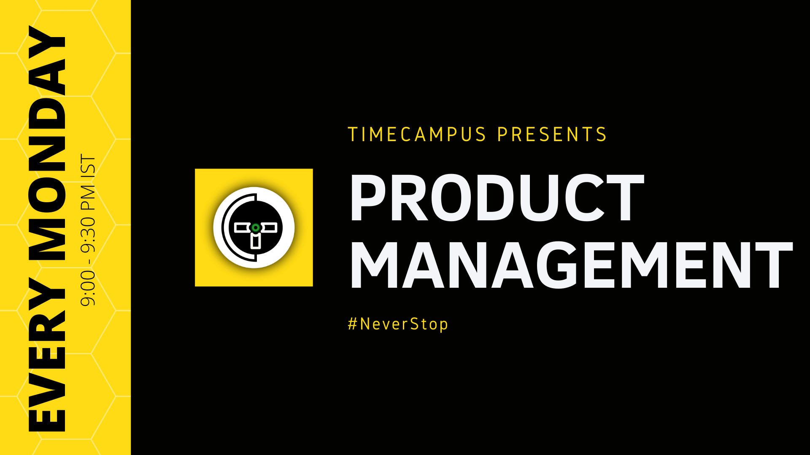

import Jump from '@site/src/components/Jump';
import Alert from '@site/src/components/Alert';

## Seasons

- [Seasons](#seasons)
    - [Season 1](#season-1)
    - [Season 2](#season-2)

#### Season 1

1. [Product - Why, What, How & Who](Season-1/PM-S01E01/README.md)

2. [The Lifecycle](Season-1/PM-S01E02/README.md)

3. [The Experience & Research](Season-1/PM-S01E03/README.md)

4. [The Workflows](Season-1/PM-S01E04/README.md)

5. [The Tools](Season-1/PM-S01E05/README.md)

6. [User Interface & User Experience](Season-1/PM-S01E06/README.md)

7. [Roadmap & Prioritization](Season-1/PM-S01E07/README.md)

8. [Collaboration, Communication, Ownership & Delegation](Season-1/PM-S01E08/README.md)

9. [The Qualities](Season-1/PM-S01E09/README.md)

10. [Discovery & First-time Experience](Season-1/PM-S01E10/README.md)

11. [The Funnel](Season-1/PM-S01E11/README.md)

12. [The Specification](Season-1/PM-S01E12/README.md)

#### Season 2

1. [Design Systems](Season-2/PM-S02E01/README.md)

2. [Testing the Market](Season-2/PM-S02E02/README.md)

3. [Metrics, Indicators, Data & Growth](Season-2/PM-S02E03/README.md)

4. [The Feedback, Customer Interviews, Surveys & Support Loop](Season-2/PM-S02E04/README.md)

5. [Innovation](Season-2/PM-S02E05/README.md)

6. [Release Management](Season-2/PM-S02E06/README.md)

7. [Technology & Compliance](Season-2/PM-S02E07/README.md)

8. [Documentation, Help & FAQ](Season-2/PM-S02E08/README.md)

9. [Customer Interviews & Surveys](Season-2/PM-S02E09/README.md)

10. [USP, Competition, Market & Value](Season-2/PM-S02E10/README.md)

11. [Designing for Accessibility, Performance, Scalability & Stability](Season-2/PM-S02E11/README.md)

12. [Creating the Brand](Season-2/PM-S02E12/README.md)