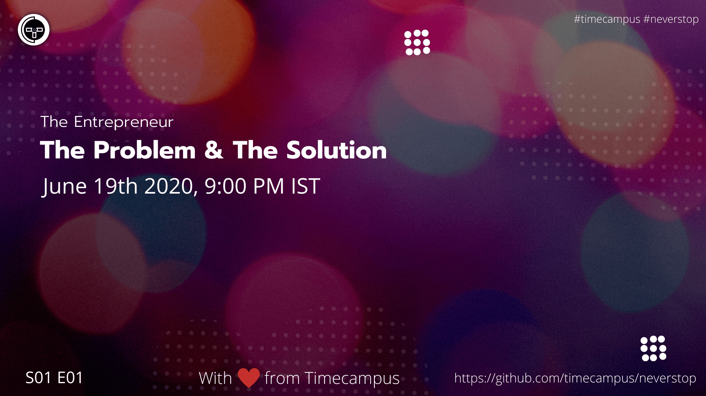

# The Entrepreneur S01E01 - The Problem & The Solution

In this episode, we will be giving you an intro to the series and also be talking about The Problem, Solution & other things needed to being an entrepreneur.

## Stream Links

Youtube: https://www.youtube.com/watch?v=-Hfayg7Z8Rg

Facebook: https://www.facebook.com/timecampustech/live/

Twitch: https://www.twitch.tv/timecampus

Periscope: https://periscope.tv/timecampus

Smashcast: https://www.smashcast.tv/timecampus

## Schedule

[June 19th 2020, 9:00 PM - 9:30 PM Indian Standard Time (IST)](https://calendar.google.com/event?action=TEMPLATE&tmeid=N2RobjJjYmMxZXYzdGtpNmw1czJrZ2c3MjIgdGltZWNhbXB1cy5jb21fM2hxNHB0a3MwbGUycm5kMGowMW82MDE0YWdAZw&tmsrc=timecampus.com_3hq4ptks0le2rnd0j01o6014ag%40group.calendar.google.com)

30 minutes for the session, Q&A in the middle

## Agenda

The agenda of this session are as follows

- [ ]About the Series
- [ ]The Entrepreneur
- [ ]The Problem
- [ ]The Solution
- [ ]The Business
- [ ]Pitching
- [ ]The Customer

## Resources

[View Slides](https://docs.google.com/presentation/d/16Mbpq8b8obBqbFJNfVlkrYqSV7Dc6GuFNg5nKoc8Vs4/edit?usp=sharing)

## Speaker(s)

- [Vignesh T.V.](http://tvvignesh.com/)