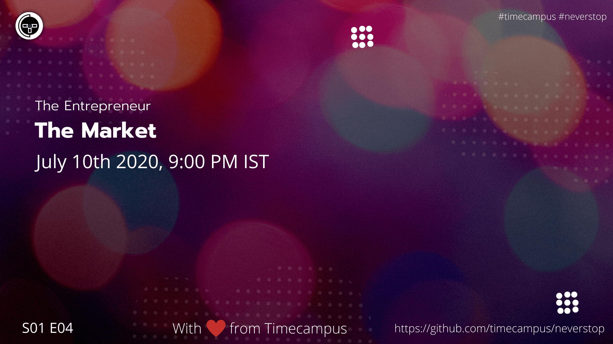

# The Entrepreneur S01E04 - The Problem & The Solution

In this episode, we will be giving you an idea about the selecting the right target audience, assessing the market conditions, competitors, the factors and way to approach the market of your choice.

## Stream Links

Youtube: https://www.youtube.com/watch?v=riPC5XJx3ik

Facebook: https://www.facebook.com/timecampustech/live/

Twitch: https://www.twitch.tv/timecampus

Periscope: https://periscope.tv/timecampus

Smashcast: https://www.smashcast.tv/timecampus

## Schedule

[July 10th 2020, 9:00 PM - 9:30 PM Indian Standard Time (IST)](https://calendar.google.com/event?action=TEMPLATE&tmeid=MjlrbzloN2lhcGtkdmJnb2J1MnRvZ2R0OTdfMjAyMDA3MTBUMTUzMDAwWiB0aW1lY2FtcHVzLmNvbV8zaHE0cHRrczBsZTJybmQwajAxbzYwMTRhZ0Bn&tmsrc=timecampus.com_3hq4ptks0le2rnd0j01o6014ag%40group.calendar.google.com)

30 minutes for the session, Q&A in the middle

## Agenda

The agenda of this session are as follows

- [ ]The Target Audience
- [ ]The Competition
- [ ]Factors of influence
- [ ]Research, Surveys & Analysis
- [ ]The Strategy

## Resources

[View Slides](https://docs.google.com/presentation/d/1Okc_qddwT2gHLAlK9wHTkmmq0roBNEvO5-ykN4oEt4A/edit?usp=sharing)

## Speaker(s)

- [Vignesh T.V.](http://tvvignesh.com/)