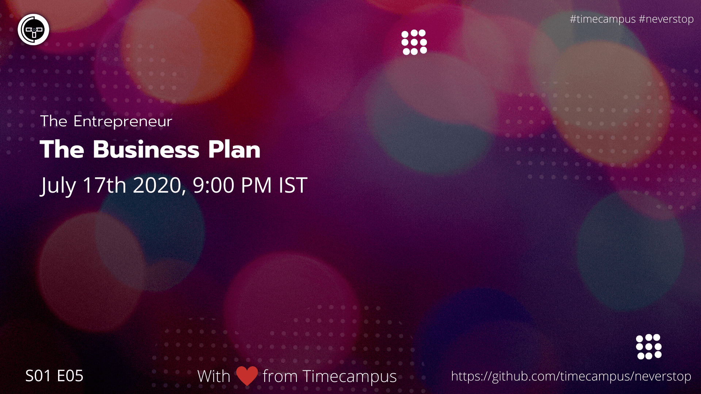

# The Entrepreneur S01E05 - The Business Plan

In this episode, we will be giving you an idea about how a business plan is to be made.

## Stream Links

Youtube: https://www.youtube.com/watch?v=zidoRnX1Phk

Facebook: https://www.facebook.com/timecampustech/live/

Twitch: https://www.twitch.tv/timecampus

Mixer: https://mixer.com/timecampus

Periscope: https://periscope.tv/timecampus

Smashcast: https://www.smashcast.tv/timecampus

## Schedule

[July 17th 2020, 9:00 PM - 9:30 PM Indian Standard Time (IST)](https://calendar.google.com/event?action=TEMPLATE&tmeid=MjlrbzloN2lhcGtkdmJnb2J1MnRvZ2R0OTdfMjAyMDA3MTdUMTUzMDAwWiB0aW1lY2FtcHVzLmNvbV8zaHE0cHRrczBsZTJybmQwajAxbzYwMTRhZ0Bn&tmsrc=timecampus.com_3hq4ptks0le2rnd0j01o6014ag%40group.calendar.google.com)

30 minutes for the session, Q&A in the middle

## Agenda

The agenda of this session are as follows

- [ ]The Target Audience
- [ ]The Competition
- [ ]Factors of influence
- [ ]Research, Surveys & Analysis
- [ ]The Strategy

## Resources

[View Slides](https://docs.google.com/presentation/d/1LE5mWUS-7QlSBWv2Fn5VXVm5_qior52SB1rVkWSoiOQ/edit?usp=sharing)

[Sample 1](./sample-1.pdf)

[Sample 2](./sample-2.pdf)

[Sample 3](./sample-3.pdf)

## References

- https://www.startups.com/library/expert-advice/top-4-business-plan-examples
- https://articles.bplans.com/a-standard-business-plan-outline/

## Speaker(s)

- [Vignesh T.V.](http://tvvignesh.com/)