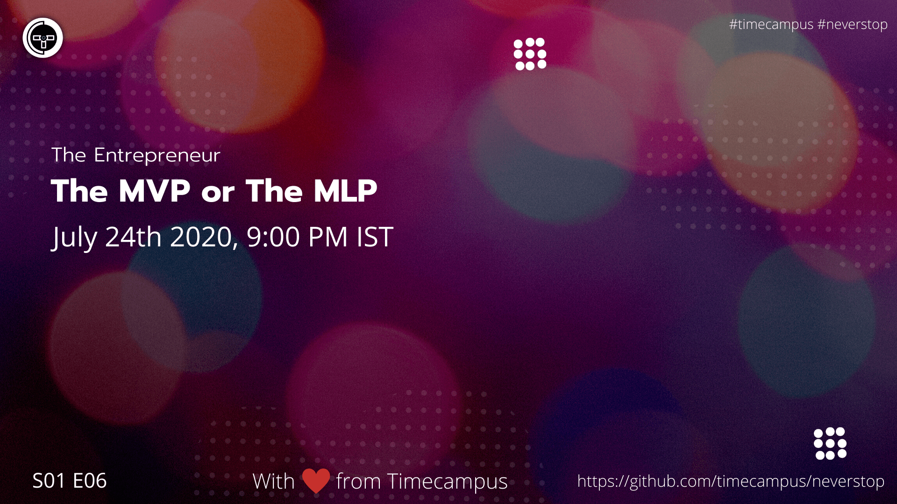

# The Entrepreneur S01E06 - The MVP or MLP

In this episode, we will be giving you an idea about how a business plan is to be made.

## Stream Links

Youtube: https://www.youtube.com/watch?v=FV_7FtEL7kI

Facebook: https://www.facebook.com/timecampustech/live/

Twitch: https://www.twitch.tv/timecampus

Mixer: https://mixer.com/timecampus

Periscope: https://periscope.tv/timecampus

Smashcast: https://www.smashcast.tv/timecampus

## Schedule

[July 24th 2020, 9:00 PM - 9:30 PM Indian Standard Time (IST)](https://calendar.google.com/event?action=TEMPLATE&tmeid=MjlrbzloN2lhcGtkdmJnb2J1MnRvZ2R0OTdfMjAyMDA3MjRUMTUzMDAwWiB0aW1lY2FtcHVzLmNvbV8zaHE0cHRrczBsZTJybmQwajAxbzYwMTRhZ0Bn&tmsrc=timecampus.com_3hq4ptks0le2rnd0j01o6014ag%40group.calendar.google.com)

30 minutes for the session, Q&A in the middle

## Agenda

- [ ] Why, What, How
- [ ] The Target Audience
- [ ] Scope & Prioritization
- [ ] Going Agile
- [ ] The Runway
- [ ] MVP vs MLP
- [ ] Inspirations

## Resources

[View Slides](https://docs.google.com/presentation/d/1iSEfCOCy3lyOP5D5SmuqIb9hd408LMJWL5i1ykGK6aY/edit?usp=sharing)

## References

- https://djangostars.com/blog/guide-mvp-mmp-mlp-mdp-map-startup-stages/
- https://themindstudios.com/blog/mlp-vs-mvp-vs-mmp/

## Speaker(s)

- [Vignesh T.V.](http://tvvignesh.com/)