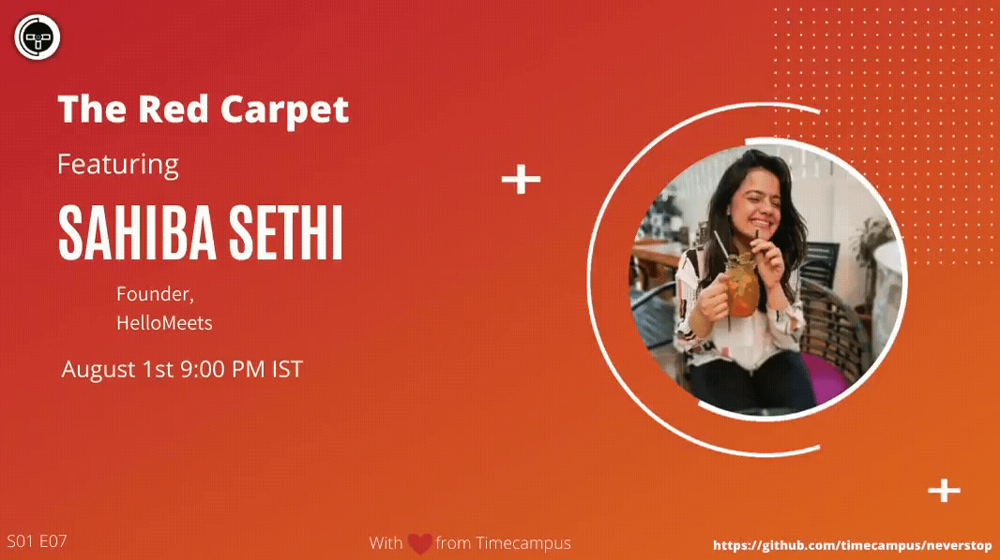

# The Red Carpet S01E07 - Sahiba Sethi, Founder, HelloMeets

In this episode, we will be hosting Ms.Sahiba Sethi,Founder,HelloMeets and will be talking about all her experience building her startup HelloMeets from ground up, attracting active volunteers, bootstrap it and scaling it to 7 cities and 2 countries and also authoring a book in the process.

## Stream Links

Youtube: https://www.youtube.com/watch?v=kp5VVyucZ_c

Facebook: https://www.facebook.com/timecampustech/live/

Twitch: https://www.twitch.tv/timecampus

Periscope: https://periscope.tv/timecampus

Smashcast: https://www.smashcast.tv/timecampus

## Schedule

[August 1st 2020, 9:00 PM - 9:30 PM Indian Standard Time (IST)](https://calendar.google.com/event?action=TEMPLATE&tmeid=MGYyc21paWF1ZTl0Y2JjM2IzN2tkY3FsYWlfMjAyMDA4MDFUMTUzMDAwWiB0aW1lY2FtcHVzLmNvbV8zaHE0cHRrczBsZTJybmQwajAxbzYwMTRhZ0Bn&tmsrc=timecampus.com_3hq4ptks0le2rnd0j01o6014ag%40group.calendar.google.com)

30 minutes for the session, Q&A in the middle

## Agenda

Just a casual chat with Ms.Sahiba Sethi from Hello Meets and we will see what we have to learn from her.

## Resources

[View Slides](https://docs.google.com/presentation/d/1-5DYZt3RWCrf4yYsyiXFA0m9IjOxBkHg3q3dSjPqRt0/edit?usp=sharing)

## Speaker(s)

- [Ms. Sahiba Sethi](https://www.linkedin.com/in/sahibasethifounderhellomeets/)

- [Vignesh T.V.](http://tvvignesh.com/)