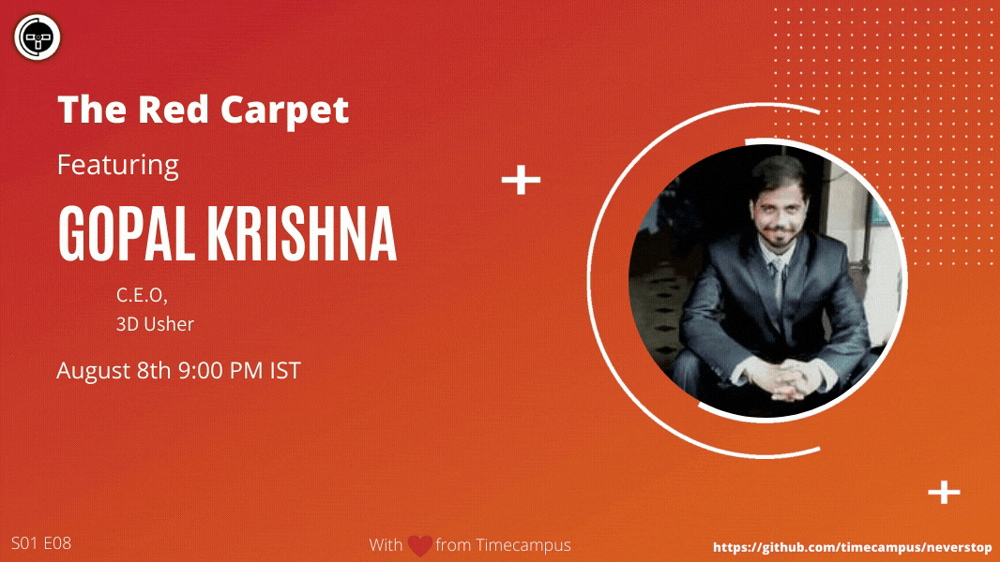

# The Red Carpet S01E08 - Gopal Krishna, C.E.O, 3D Usher

<!--  -->

In this episode, we will be hosting Mr.Gopal Krishna,C.E.O,3D Usher and will be talking about all his experience building his startup 3D Usher after spending a good amount of time working on his other startups like Global 3D Labs, Foodzoned and Chill Maadi. We will discuss about his entrepreneurship journey, the challenges he faced, strategy and will also touch upon his industry of 3D Printing and Technology.

## Stream Links

Youtube: https://www.youtube.com/watch?v=rIQrthsr6aA

Facebook: https://www.facebook.com/timecampustech/live/

Twitch: https://www.twitch.tv/timecampus

Periscope: https://periscope.tv/timecampus

Smashcast: https://www.smashcast.tv/timecampus

## Schedule

[August 8th 2020, 9:00 PM - 9:30 PM Indian Standard Time (IST)](https://calendar.google.com/event?action=TEMPLATE&tmeid=MGYyc21paWF1ZTl0Y2JjM2IzN2tkY3FsYWlfMjAyMDA4MDhUMTUzMDAwWiB0aW1lY2FtcHVzLmNvbV8zaHE0cHRrczBsZTJybmQwajAxbzYwMTRhZ0Bn&tmsrc=timecampus.com_3hq4ptks0le2rnd0j01o6014ag%40group.calendar.google.com)

---

## Speaker Profile

- Co-Founder & C.E.O, [3D Usher](https://3dusher.com/)

- Co-Founder & C.E.O, [Global 3D Labs](https://global3dlabs.com/)

- Co-Founder, [Foodzoned](https://www.foodzoned.com/)

- Co-Founder, [Chill Maadi](https://www.facebook.com/chillmaadi/)

---

## Agenda

A casual chat with Mr.Gopal Krishna from 3D Usher and we will see what we have to learn from him.

## Speaker(s)

- [Mr. Gopal Krishna](https://www.linkedin.com/in/gopalkrishna/)

- [Vignesh T.V.](http://tvvignesh.com/)
